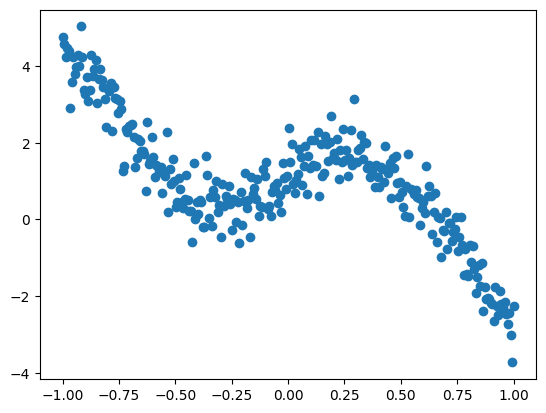
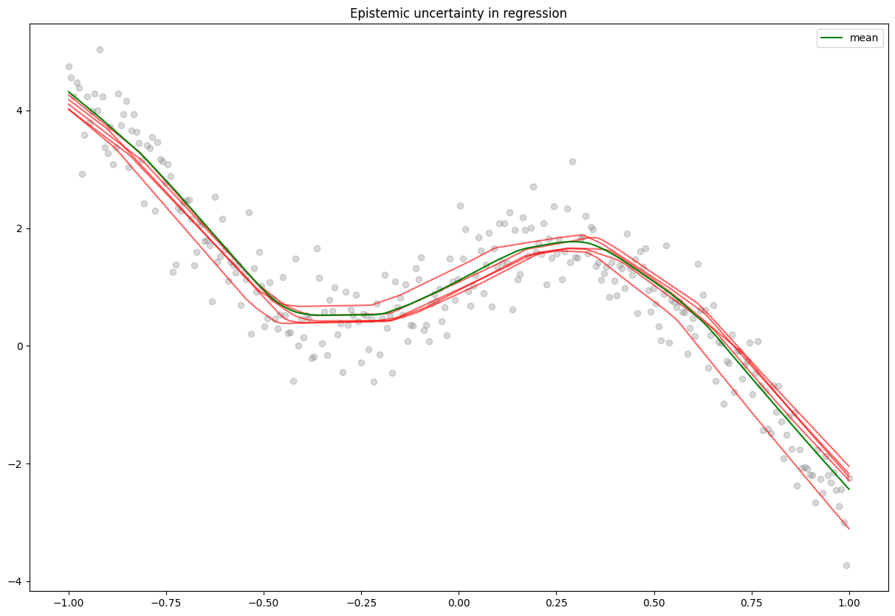

# Uncertainty with Bayesian Neural Networks

**Bayesian Neural Networks** (BNN) can be understood as a combination of neural networks and bayesian inference. In traditional deep learning, weights are fixed values (initially random), that we iteratively update via gradient descent. BNN on the other hand learn __distribution parameters over weights__, these distribution parameters are learned using bayesian inference. This approaches allows, among others, to measure uncertainty among predictions.

# Bayesian inference 

In bayesian inference we try to compute $p(w | D_{train})$, the conditional distribution of the weights given the data, aka the *posterior distribution*, rather than static parameters values. 

### Exact Bayesian Inference

Thanks to Bayes' rule we can compute the posterior : 

\begin{align*}
    p(w | D) & = \frac{p(D | w)p(w)}{p(D)}\\
             & = \frac{p(D | w)p(w)}{\int_w' p(D | w')p(w')} \\
\end{align*}

With $\hat{y}$ the predicted output as a function of the input $x$, The posterior distribution over the weights allows us to compute the __predictive distribution__ : 

\begin{align*}
    p(\hat{y}(x) | D) = \int_w p(\hat{y}(x) | w) p(w | D) dw = \mathbb{E}_{p(w | D)} [p(\hat{y}(x) | w)]
\end{align*}

which can be useful to describe the epistemic uncertainty of our model. We will come back later on the uncertainty.

Computing the posterior in this way can be called *exact inference*, and needs the *prior* $p(w)$ and the *likelihood* $p(D | w)$ of the data. Unfortunately in the expression of the posterior and the predictive distribution we need to integrate over the weight space which can be intractable, in order to adresses theses issues we use a set of tools that allow us to do approximate inference. There is two family of approximate inference methods : sampling and variational, we will focus on variational methods.

### Variational inference

The spirit of variational inference is, when facing an intractable posterior $p(w | D)$, to surrogate it with a parametrized distribution $q_{\phi}(w)$, namely the *approximate posterior*. This surrogate distribution will be optimised (by tuning its parameters $\phi$) in order to be as close as possible to the original posterior. In practice the choice of the approximate distribution can be seen as an hyperparameter. Two main questions arise from this : 

* **How to check if the surrogate is close to the true posterior ?** 
* **How to maximize the similarity of our distributions ?**


### Measure of similarity : 

The Kullback-Liebler divergence is a metric that allows us to mesure the similiarity between two distribution. it is defined by the expectation of the log ratio between the two distributions : 

\begin{align*}
    D_{KL}(P \| Q) = \mathbb{E} \left[log \frac{P}{Q}\right]
\end{align*}

in our case : 

\begin{align*}
    D_{KL} (q_{\phi}(w) \| p(w | D)) & = \mathbb{E}_{q_{\phi}(w)}\left[log \frac{q_{\phi}(w)}{p(w |D)} \right] \\
                                    & = \int_w q_\phi (w) log \frac{q_\phi (w)}{p(w |D)}
\end{align*}


The KL divergence is a non-negative measure of similarity, that is 0 for identical distributions
... 

### Derive a tractable optimization problem : 

We have an intractable posterior $p(w | W)$, a surrogate distribution $q_{\phi}(w)$, a way to measure their similarity  $D_{KL} (q_{\phi}(w) \| p(w | D))$, now we need find a way to minimize their dissimilarity. To do this we will formulate it as an optimization problem. 

Directly minimizing  $D_{KL} (q_{\phi}(w) \| p(w | D))$ is 
difficult as $p(w | D)$ is still intractable. To bypass this we will derive a related quantity, equal to the KL divergence plus a constant, that will be our new objective.

\begin{align*}
    D_{KL} (q_{\phi}(w) \| p(w | D)) & = \mathbb{E}_{q_{\phi}(w)}\left[log \frac{q_{\phi}(w)}{p(w |D)} \right] \\
                                     & = \mathbb{E}_{q_{\phi}(w)}\left[log(q_{\phi}(w)) - log (p(w |D)) \right] \\
                                     & = \mathbb{E}_{q_{\phi}(w)}\left[log(q_{\phi}(w))\right] - \mathbb{E}_{q_{\phi}(w)}\left[log (p(D, w)) - log (p(D)) \right] \\        
                                     & = \mathbb{E}_{q_{\phi}(w)}\left[log(q_{\phi}(w))\right] - \mathbb{E}_{q_{\phi}(w)}\left[log (p(D, w))\right] + log p(D)\\                   
\end{align*}

thus 

\begin{align*} 
    log p(D) \geq \mathbb{E}_{q_{\phi}(w)}\left[log q_{\phi}(w) - log p(w, D)\right] \;\;\;\;\;\;\;\; \;\;\;\;\;\;\;\;\; [\small{\text{as}\;\;\; D_{KL}(q \| p) \geq 0}]
\end{align*}

## Make it work with neural networks.
### bayes by backprop

Once our optimization problem formulated we want to be able to optimize it, and in the context of neural networks, using gradient descent. Hence we need a proper algortihm adapted for backpropagation. To do so we will use bayes by backpropagation, a backpropagation compatible algorithm for learning a probability distribution on the weights of a neural network. \cite{Blundell et al.}. 

In bayesian neural networks, it is challenging to differentiate random nodes. To overcome this we will use a tool called the reparametrization trick. Intuitively, the reparametrization trick allows to flow gradient through random nodes by moving the randomness outside of the node, rending it deterministic. As such, backprop can be applied to our variational parameter $\phi$. This gives us the advantage of maintaining a training loop analogous to that of a standard neural network, which is convenient as it permits the use of traditional optimizers, such as Adam.

More formally, considering a gaussian posterior distribution $q_{\phi}(z|x)$, parametrized by $\mu$ and $\sigma$. say we want to minimize a loss function $E_{q_{\phi}(z | x)} [f(z))]$. 
Directly optimizing this expectation with respect to $\phi$ can be difficult due to its randomness in z complicating the computation of gradients. To overcome this we introduce an auxilary variable $\epsilon$ drawn from a distribution $p(\epsilon)$ independent from $\phi$ allowing us to express z as a deterministic function of $\phi$ and $\sigma$ such as $z = g_{\phi}(\epsilon, x) = \mu(x; \mu) + \sigma(w, \phi) \otimes \epsilon$. Typically $\epsilon$ is drawn from Gaussian ditribution $\epsilon \sim \mathcal{N}(0, I)$. Thus the expectation turns into : 

\begin{align*}
    \nabla_{\phi} E_{p(\epsilon)}[f(g_{\phi}(\epsilon, x))] &= E_{p(\epsilon)}[ \nabla_{\phi} f(g_{\phi}(\epsilon, x))] 
\end{align*} 

# Import, data and utils functions 


```python
import warnings
warnings.filterwarnings('ignore')
```


```python
import os
import numpy as np
import pandas as pd

import matplotlib.pyplot as plt
import tensorflow as tf

from sklearn.model_selection import train_test_split
from sklearn.datasets import make_moons
from sklearn.metrics import accuracy_score

import tensorflow as tf
from tensorflow import keras
from tensorflow.keras.models import Sequential
from tensorflow.keras.layers import Dense, BatchNormalization, Dropout

import tensorflow_probability as tfp
from tensorflow_probability import distributions as tfd
```

# Dataset

- Basic non-linear dataset for a classification problem


```python
X, y = make_moons(n_samples=20000, noise=0.3)
y = y.reshape(-1,1) 

X_train, X_test, y_train, y_test = train_test_split(X, y, test_size=0.2)

X_test = tf.cast(X_test, tf.float32)
X_train = tf.cast(X_train, tf.float32)
y_test = tf.cast(y_test, tf.float32)
y_train = tf.cast(y_train, tf.float32)

fig, (ax1, ax2) = plt.subplots(2, 1, figsize=(8, 12))
ax1.scatter(X_train[:,0], X_train[:,1], c=y_train)
ax1.set_title('train set')
ax2.scatter(X_test[:,0], X_test[:,1], c=y_test)
ax2.set_title('test set')

plt.show()
```


    

    


# Baseline model
traditional deep net


```python
def create_network(units=100, activation='relu', lr=0.01) : 
    
    inputs = keras.Input(shape=(X_train.shape[1],))
    
    hidden1 = Dense(units, activation=activation)(inputs)
    hidden1 = BatchNormalization()(hidden1)
    
    hidden2 = Dense(units, activation=activation)(hidden1)
    hidden2 = BatchNormalization()(hidden2)
    
    hidden3 = Dense(units, activation=activation)(hidden2)
    hidden3 = BatchNormalization()(hidden3)
    
    outputs = Dense(1, activation='sigmoid')(hidden3)
    
    model = keras.Model(inputs=inputs, outputs=outputs, name='baseline')

    opt = keras.optimizers.Adam(learning_rate=lr)
    model.compile(loss='binary_crossentropy', optimizer=opt, metrics=['Accuracy'])
    model.summary()
    return model
```


```python
baseline = create_network()
baseline.fit(X_train, y_train, batch_size=32, verbose=0, epochs=20) 
```

    Model: "baseline"
    _________________________________________________________________
     Layer (type)                Output Shape              Param #   
    =================================================================
     input_1 (InputLayer)        [(None, 2)]               0         
                                                                     
     dense (Dense)               (None, 100)               300       
                                                                     
     batch_normalization (Batch  (None, 100)               400       
     Normalization)                                                  
                                                                     
     dense_1 (Dense)             (None, 100)               10100     
                                                                     
     batch_normalization_1 (Bat  (None, 100)               400       
     chNormalization)                                                
                                                                     
     dense_2 (Dense)             (None, 100)               10100     
                                                                     
     batch_normalization_2 (Bat  (None, 100)               400       
     chNormalization)                                                
                                                                     
     dense_3 (Dense)             (None, 1)                 101       
                                                                     
    =================================================================
    Total params: 21801 (85.16 KB)
    Trainable params: 21201 (82.82 KB)
    Non-trainable params: 600 (2.34 KB)
    _________________________________________________________________


    <keras.src.callbacks.History at 0x7f08c467b0d0>


- Evaluate the model


```python
y_pred = np.asarray(baseline(X_test))

print('accuracy : ', accuracy_score(y_test, y_pred.round()))

fig, (ax1,ax2,ax3) = plt.subplots(3,1, figsize=(8, 14))
ax1.scatter(X_test[:,0], X_test[:,1], c=y_test)
ax1.set_title('original dataset')

ax2.scatter(X_test[:,0], X_test[:,1], c=y_pred.round())
ax2.set_title('predictions rounded')

ax3.scatter(X_test[:,0], X_test[:,1], c=y_pred)
ax3.set_title('predictions, not rounded, i.e sharpness')

plt.show()
```

    accuracy :  0.902


    

    


The sharpness of the predictions can already give a sense of uncertainty of the model on its predictions.

* ### Aleatoric uncertainty (aka statistical) : 
Aleatoric uncertainty refers to the notion of randomness, That is the uncertainty rising from the datahimself, where the model cannot act.

To allow a model to capture the aleatoric uncertainty we will output not a point estimate as usual but a probability distribution. In the case of binary classification the output will be a bernoulli distribution. 

$
    \mathbb{P}(X = x) = p^x(1 - p)^{1-x},\;\; x \in [0, 1]
$

As the output is no more a single estimate we need to change the loss function, we will use the **negative loglieklihood**, in order to get how likely it is to encounter targets in our data from the estimated distribution of the model.


```python
def nll(y, y_pred): 
  return -y_pred.log_prob(y)
```

In practice the only modification to our baseline model is the ouput layer. In our case we will use a *IndependentBernoulli* layer.


```python
def create_aleatoric_model(units=100, activation='relu', lr=0.001):

  inputs = keras.Input(shape=(X_train.shape[1],))

  hidden1 = Dense(units, activation=activation)(inputs)
  hidden1 = BatchNormalization()(hidden1)
  hidden1 = Dropout(0.1)(hidden1)

  hidden2 = Dense(units, activation=activation)(hidden1)
  hidden2 = BatchNormalization()(hidden2)
  hidden2 = Dropout(0.1)(hidden2)
  
  hidden3 = Dense(units, activation=activation)(hidden2)
  hidden3 = BatchNormalization()(hidden3)
  hidden3 = Dropout(0.1)(hidden3)

  # output Bernoulli distribution  
  outputs = Dense(tfp.layers.IndependentBernoulli.params_size(1))(hidden3)  
  outputs = tfp.layers.IndependentBernoulli(1)(outputs)

  model = keras.Model(inputs=inputs, outputs=outputs, name='aleatoric_BNN')

  opt = keras.optimizers.Adam(learning_rate=lr)
  model.compile(loss=nll, optimizer=opt, metrics=['Accuracy'])
  model.summary()
  return model
```


```python
aleatoric_model = create_aleatoric_model()
aleatoric_model.fit(X_train, y_train, batch_size=32, verbose=0, epochs=20) 
```

    Model: "aleatoric_BNN"
    _________________________________________________________________
     Layer (type)                Output Shape              Param #   
    =================================================================
     input_2 (InputLayer)        [(None, 2)]               0         
                                                                     
     dense_4 (Dense)             (None, 100)               300       
                                                                     
     batch_normalization_3 (Bat  (None, 100)               400       
     chNormalization)                                                
                                                                     
     dropout (Dropout)           (None, 100)               0         
                                                                     
     dense_5 (Dense)             (None, 100)               10100     
                                                                     
     batch_normalization_4 (Bat  (None, 100)               400       
     chNormalization)                                                
                                                                     
     dropout_1 (Dropout)         (None, 100)               0         
                                                                     
     dense_6 (Dense)             (None, 100)               10100     
                                                                     
     batch_normalization_5 (Bat  (None, 100)               400       
     chNormalization)                                                
                                                                     
     dropout_2 (Dropout)         (None, 100)               0         
                                                                     
     dense_7 (Dense)             (None, 1)                 101       
                                                                     
     independent_bernoulli (Ind  ((None, 1),               0         
     ependentBernoulli)           (None, 1))                         
                                                                     
    =================================================================
    Total params: 21801 (85.16 KB)
    Trainable params: 21201 (82.82 KB)
    Non-trainable params: 600 (2.34 KB)
    _________________________________________________________________


    <keras.src.callbacks.History at 0x7f0874533bb0>


**The standard deviation of the outputed distribution will represent te aleatoric uncertainty associated with the dataset :**


```python
pred_distribution = aleatoric_model(X_test)
pred_mean = pred_distribution.mean().numpy()
pred_stdv = pred_distribution.stddev().numpy()

print('accuracy : ', accuracy_score(y_test, pred_mean.round()))

fig, axs = plt.subplots(4, 1, figsize=(8,14))
axs[0].scatter(X_test[:,0], X_test[:,1], c=y_test)
axs[0].set_title('test set')
axs[1].scatter(X_test[:,0], X_test[:,1], c=pred_mean.round())
axs[1].set_title('predictions on the test set')
axs[2].scatter(X_test[:,0], X_test[:,1], c=pred_mean)
axs[2].set_title('predictions (color gradient on prediction mean i.e sharpness)')
points2 = axs[3].scatter(X_test[:,0], X_test[:,1], c=pred_stdv, cmap='plasma')
axs[3].set_title('standard deviation of the predicted distribution, the closer to yellow the higher aleatoric uncertainty is')

fig.colorbar(points2)

plt.tight_layout()
```

    accuracy :  0.9025


    

    


* ### Epistemic uncertainty (aka systematic) : 
refers to uncertainty caused by a lack of knowledge. It can be seen as the uncertainty of the model itself on his predictions. The epistemic uncertainty is the ability of the model saying 'I don't know'.

In practice, we will use tfp ```DenseVariational``` layers to do variational inference. Recall variational inference relies on Bayesian inference. Thus we need to define a prior $p(w)$ and a posterior distribution $p(w|D)$. The choice of these distributions can be seen as hyperparameters. Prior are imortant as they have a regularization aspect.  Here are listed a few options available with tfp :  

### Priors

* Normal (or Gaussian) prior
  
A basic reasonable approach is a normal prior distribution.  The normal prior acts as a form of regularization, penalizing large weights by making them less probable a priori. This is analogous to L2 regularization (or Ridge regression) in frequentist statistics, where the penalty on the weights is proportional to their squared magnitude.

The normal prior promotes smoothness and smaller magnitudes in the weights but does not explicitly push them to zero. This can lead to models that are less sparse but potentially more stable, as small changes in the input data are less likely to result in large changes in the output.


```python
def normal_prior(kernel_size, bias_size, dtype=None): 
    n = kernel_size + bias_size
    prior_model = keras.Sequential(
    [
          tfp.layers.DistributionLambda(lambda t: tfd.Independent(
            tfd.Normal(loc=tf.zeros(n),
                       scale=2*tf.ones(n)), 
          reinterpreted_batch_ndims=1)),
    ])
    return prior_model
```

* Multivariate Normal prior 

As opposed to independent normal priors, where each connexion has its own independent distribution, a mutlivariate normal distribution assigns weights to each neurones of a layer and this thus useful to capture correlation between weights.


```python
def multivariate_normal_prior(kernel_size, bias_size, dtype=None): 
    n = kernel_size + bias_size
    prior_model = keras.Sequential(
        [
            tfp.layers.DistributionLambda(
                lambda t: tfd.MultivariateNormalDiag(
                    loc=tf.zeros(n), scale_diag=tf.ones(n)
                )
            )
        ]
    )
    return prior_model
```

* Laplace prior

the Laplace prior induces sparsity in a more direct manner. It is analogous to L1 regularization (or the Lasso method) in frequentist statistics.

The Laplace prior encourages sparsity in the model parameters by having a sharp peak at zero and heavy tails. This means that it pushes coefficients towards exactly zero, effectively performing variable selection or feature elimination, which can be beneficial in models with many irrelevant features.


```python
def laplace_prior(kernel_size, bias_size, dtype=None):
    n = kernel_size + bias_size # num of params
    return Sequential([
       tfp.layers.DistributionLambda(
           lambda t: tfd.Independent(tfd.Laplace(loc = tf.zeros(n), 
                                                 scale=tf.ones(n)),
                                     reinterpreted_batch_ndims=1))               
  ])
```

* Horseshoe prior

The Horseshoe prior introduces a form of regularization that is more adaptive compared to traditional techniques like L1 or L2 regularization. It can shrink less relevant weights more aggressively towards zero while allowing important weights to remain large, potentially leading to a more sparse and efficient network. It can be used aswell to prune the network by shifting useless connexions towards 0.


```python
def horseshoe_prior(kernel_size, bias_size, dtype=None):
    n = kernel_size + bias_size # num of params
    return Sequential([
       tfp.layers.DistributionLambda(
           lambda t: tfd.Independent(tfd.Horseshoe(scale = tf.zeros(n),
                                                   reinterpreted_batch_ndims=1)))               
  ])
```

### Posteriors

In variational inference, using a independent normal distribution is a common practice as it ensures mathematical conveniance. They also enable the use of the reparametrization trick, allowing gradient estimations.


```python
def posterior(kernel_size, bias_size, dtype=None):
    n = kernel_size + bias_size
    return tf.keras.Sequential([
      tfp.layers.VariableLayer(2 * n, dtype=dtype),
      tfp.layers.DistributionLambda(lambda t: tfd.Independent(
          tfd.Normal(loc=t[..., :n],
                     scale=tf.nn.softplus(t[..., n:])),
          reinterpreted_batch_ndims=1)),
    ])
```


```python
def posterior(kernel_size, bias_size, dtype=None): 
    n = kernel_size + bias_size
    posterior_model = keras.Sequential(
        [
            tfp.layers.VariableLayer(
                tfp.layers.MultivariateNormalTriL.params_size(n), dtype=dtype
            ),
            tfp.layers.MultivariateNormalTriL(n),
        ]
    )
    
    return posterior_model
```


```python
def posterior(kernel_size, bias_size, dtype=None):
  n = kernel_size + bias_size
  posterior_model = keras.Sequential(
        [
            tfp.layers.VariableLayer(
                tfp.layers.IndependentNormal.params_size(n), dtype=dtype
            ),
            tfp.layers.IndependentNormal(n),
        ]
    )
    
  return posterior_model
```

## Epistemic model


```python
def create_epistemic_model(prior, posterior):
  inputs = keras.Input(shape=(X_train.shape[1],))

  x = tfp.layers.DenseVariational(units=200, 
                                  make_prior_fn=prior,
                                  make_posterior_fn=posterior,
                                  kl_weight = 1 / X_train.shape[0],
                                  activation='relu')(inputs)
  
  x = tfp.layers.DenseVariational(units=200, 
                                  make_prior_fn=prior,
                                  make_posterior_fn=posterior,
                                  kl_weight = 1 / X_train.shape[0],
                                  activation='relu')(x)
                        
  outputs = tfp.layers.DenseVariational(units=1, 
                                  make_prior_fn=prior,
                                  make_posterior_fn=posterior,
                                  kl_weight = 1 / X_train.shape[0],
                                  activation='sigmoid')(x)

  model = keras.Model(inputs=inputs, outputs=outputs, name='epistemic_BNN')

  opt = keras.optimizers.Adam(learning_rate=0.001)

  model.compile(loss=tf.keras.losses.BinaryCrossentropy(), 
                optimizer=opt, metrics=['Accuracy'])
  model.summary()

  return model
```


```python
epistemic_model = create_epistemic_model(multivariate_normal_prior, posterior)
epistemic_model.fit(X_train, y_train, batch_size=32, verbose=0, epochs=500) 
```

    Model: "epistemic_BNN"
    _________________________________________________________________
     Layer (type)                Output Shape              Param #   
    =================================================================
     input_4 (InputLayer)        [(None, 2)]               0         
                                                                     
     dense_variational_3 (Dense  (None, 200)               1200      
     Variational)                                                    
                                                                     
     dense_variational_4 (Dense  (None, 200)               80400     
     Variational)                                                    
                                                                     
     dense_variational_5 (Dense  (None, 1)                 402       
     Variational)                                                    
                                                                     
    =================================================================
    Total params: 82002 (320.32 KB)
    Trainable params: 82002 (320.32 KB)
    Non-trainable params: 0 (0.00 Byte)
    _________________________________________________________________


    <keras.src.callbacks.History at 0x7f07c0344a90>


```python
def infer(X, y, model_, it=10): 
  y_preds = []
  for _ in range(it): 
    y_preds.append(model_(X))
  
  pred_mean = np.mean(y_preds, axis=0)
  pred_stdv = np.std(y_preds, axis=0)
  
  print('accuracy : ', accuracy_score(y, pred_mean.round()))

  return pred_mean, pred_stdv
```


```python
pred_mean, pred_stdv = infer(X_test, y_test, epistemic_model, 100)

fig = plt.figure(figsize=(10, 10))

plt.subplot(4, 1, 1) 
plt.scatter(X_test[:,0], X_test[:,1], c=y_test)
plt.title('Test Set')

plt.subplot(4, 1, 2) 
plt.scatter(X_test[:,0], X_test[:,1], c=pred_mean.round())
plt.title('Predictions (Bigger Train Set)')

plt.subplot(4, 1, 3) 
plt.scatter(X_test[:,0], X_test[:,1], c=pred_mean)
plt.title('Predictions (Color Gradient on Prediction Mean i.e., Sharpness)')

plt.subplot(4, 1, 4) 
plt.scatter(X_test[:,0], X_test[:,1], c=pred_stdv)
plt.title('Standard Deviation on the Inference (The Closer to Yellow => Higher Epistemic Uncertainty)')

plt.tight_layout()
plt.show()

```

    accuracy :  0.90375


    

    


## Epistemic regression


```python
X = np.linspace(-1, 1, 300)
y = 4 * X * np.cos(np.pi * np.sin(X)) + 1 + np.random.randn(X.shape[0]) * 0.5
plt.scatter(X, y)
plt.show()
```


    

    


```python
X_train, X_test, y_train, y_test = train_test_split(X, y)
print(X_train.shape, X_test.shape)
print(y_train.shape, y_test.shape)
```

    (225,) (75,)
    (225,) (75,)


```python
plt.scatter(X_train, y_train, alpha=0.3)
plt.scatter(X_test, y_test)
plt.show()
```


    

    


```python
def posterior(kernel_size, bias_size, dtype=None):
    n = kernel_size + bias_size
    return tf.keras.Sequential([
      tfp.layers.VariableLayer(2 * n, dtype=dtype),
      tfp.layers.DistributionLambda(lambda t: tfd.Independent(

          tfd.Normal(loc=t[..., :n],
                     scale= 1e-5 + 0.003 * tf.nn.softplus(t[..., n:])),
          reinterpreted_batch_ndims=1)),
    ])
```


```python
def epistemic_regressor(prior, posterior):
  inputs = keras.Input(shape=(1,))

  x = tfp.layers.DenseVariational(units=128, 
                                  make_prior_fn=prior,
                                  make_posterior_fn=posterior,
                                  kl_weight = 1 / X_train.shape[0],
                                  activation='relu')(inputs)
  
  x = tfp.layers.DenseVariational(units=64, 
                                  make_prior_fn=prior,
                                  make_posterior_fn=posterior,
                                  kl_weight = 1 / X_train.shape[0],
                                  activation='relu')(x)
                    
  outputs = tfp.layers.DenseVariational(units=1, 
                                  make_prior_fn=prior,
                                  make_posterior_fn=posterior,
                                  kl_weight = 1 / X_train.shape[0])(x)

  model = keras.Model(inputs=inputs, outputs=outputs, name='epistemic_BNN')

  opt = keras.optimizers.Adam(learning_rate=0.001)

  model.compile(loss='mse', optimizer=opt)
  model.summary()

  return model
  
```


```python
regressor = epistemic_regressor(multivariate_normal_prior, posterior)
regressor.fit(X_train, y_train, verbose=0, batch_size=32, epochs=3000)
```

    Model: "epistemic_BNN"
    _________________________________________________________________
     Layer (type)                Output Shape              Param #   
    =================================================================
     input_14 (InputLayer)       [(None, 1)]               0         
                                                                     
     dense_variational_33 (Dens  (None, 128)               512       
     eVariational)                                                   
                                                                     
     dense_variational_34 (Dens  (None, 64)                16512     
     eVariational)                                                   
                                                                     
     dense_variational_35 (Dens  (None, 1)                 130       
     eVariational)                                                   
                                                                     
    =================================================================
    Total params: 17154 (67.01 KB)
    Trainable params: 17154 (67.01 KB)
    Non-trainable params: 0 (0.00 Byte)
    _________________________________________________________________


    <keras.src.callbacks.History at 0x7f0752a80ca0>


    Epoch 1391/2000
    8/8 [==============================] - 0s 4ms/step - loss: 653367.8750 - val_loss: 652151.5625
    Epoch 1392/2000
    8/8 [==============================] - 0s 4ms/step - loss: 652317.4375 - val_loss: 652237.5625
    Epoch 1393/2000
    8/8 [==============================] - 0s 4ms/step - loss: 655852.5000 - val_loss: 652950.1875
    Epoch 1394/2000
    8/8 [==============================] - 0s 4ms/step - loss: 651222.3125 - val_loss: 652913.0000
    Epoch 1395/2000
    8/8 [==============================] - 0s 4ms/step - loss: 652086.5000 - val_loss: 653962.7500
    Epoch 1396/2000
    8/8 [==============================] - 0s 4ms/step - loss: 651383.1875 - val_loss: 652008.8750
    Epoch 1397/2000
    8/8 [==============================] - 0s 4ms/step - loss: 651682.0625 - val_loss: 652557.8750
    Epoch 1398/2000
    8/8 [==============================] - 0s 4ms/step - loss: 651591.9375 - val_loss: 650373.1875
    Epoch 1399/2000
    8/8 [==============================] - 0s 4ms/step - loss: 651791.3750 - val_loss: 651272.1875
    Epoch 1400/2000
    8/8 [==============================] - 0s 4ms/step - loss: 652020.7500 - val_loss: 651294.5000
    Epoch 1401/2000
    8/8 [==============================] - 0s 4ms/step - loss: 652324.5625 - val_loss: 648872.6875
    Epoch 1402/2000
    8/8 [==============================] - 0s 4ms/step - loss: 650799.6875 - val_loss: 650611.0625
    Epoch 1403/2000
    8/8 [==============================] - 0s 4ms/step - loss: 649801.1875 - val_loss: 651797.1250
    Epoch 1404/2000
    8/8 [==============================] - 0s 4ms/step - loss: 650644.1875 - val_loss: 651346.0625
    Epoch 1405/2000
    8/8 [==============================] - 0s 4ms/step - loss: 651136.3125 - val_loss: 651342.3750
    Epoch 1406/2000
    8/8 [==============================] - 0s 4ms/step - loss: 651045.2500 - val_loss: 646800.1875
    Epoch 1407/2000
    8/8 [==============================] - 0s 4ms/step - loss: 648927.6875 - val_loss: 649067.2500
    Epoch 1408/2000
    8/8 [==============================] - 0s 4ms/step - loss: 649543.1250 - val_loss: 648181.3125
    Epoch 1409/2000
    8/8 [==============================] - 0s 5ms/step - loss: 650337.5000 - val_loss: 649284.3125
    Epoch 1410/2000
    8/8 [==============================] - 0s 4ms/step - loss: 650075.3750 - val_loss: 649599.6250
    Epoch 1411/2000
    8/8 [==============================] - 0s 4ms/step - loss: 649723.1875 - val_loss: 650818.5625
    Epoch 1412/2000
    8/8 [==============================] - 0s 4ms/step - loss: 648096.5625 - val_loss: 648054.1250
    Epoch 1413/2000
    8/8 [==============================] - 0s 4ms/step - loss: 648259.2500 - val_loss: 648908.9375
    Epoch 1414/2000
    8/8 [==============================] - 0s 4ms/step - loss: 646315.2500 - val_loss: 646218.3750
    Epoch 1415/2000
    8/8 [==============================] - 0s 4ms/step - loss: 648226.5000 - val_loss: 647990.9375
    Epoch 1416/2000
    8/8 [==============================] - 0s 4ms/step - loss: 648195.9375 - val_loss: 647611.8750
    Epoch 1417/2000
    8/8 [==============================] - 0s 4ms/step - loss: 649176.6250 - val_loss: 649091.6250
    Epoch 1418/2000
    8/8 [==============================] - 0s 4ms/step - loss: 648466.7500 - val_loss: 645895.8125
    Epoch 1419/2000
    8/8 [==============================] - 0s 4ms/step - loss: 645268.7500 - val_loss: 643765.0000
    Epoch 1420/2000
    8/8 [==============================] - 0s 4ms/step - loss: 646186.6250 - val_loss: 645084.7500
    Epoch 1421/2000
    8/8 [==============================] - 0s 4ms/step - loss: 646823.0625 - val_loss: 645621.1250
    Epoch 1422/2000
    8/8 [==============================] - 0s 4ms/step - loss: 643918.2500 - val_loss: 644551.8125
    Epoch 1423/2000
    8/8 [==============================] - 0s 4ms/step - loss: 645571.3125 - val_loss: 645630.7500
    Epoch 1424/2000
    8/8 [==============================] - 0s 4ms/step - loss: 645719.5625 - val_loss: 646153.1875
    Epoch 1425/2000
    8/8 [==============================] - 0s 4ms/step - loss: 645837.4375 - val_loss: 645156.3125
    Epoch 1426/2000
    8/8 [==============================] - 0s 4ms/step - loss: 643681.3750 - val_loss: 642158.0000
    Epoch 1427/2000
    8/8 [==============================] - 0s 4ms/step - loss: 646093.8750 - val_loss: 646525.1875
    Epoch 1428/2000
    8/8 [==============================] - 0s 4ms/step - loss: 646863.1250 - val_loss: 645254.4375
    Epoch 1429/2000
    8/8 [==============================] - 0s 4ms/step - loss: 644600.9375 - val_loss: 645978.0000
    Epoch 1430/2000
    8/8 [==============================] - 0s 4ms/step - loss: 645120.3125 - val_loss: 644572.9375
    Epoch 1431/2000
    8/8 [==============================] - 0s 4ms/step - loss: 643702.8750 - val_loss: 643213.8750
    Epoch 1432/2000
    8/8 [==============================] - 0s 4ms/step - loss: 644886.5000 - val_loss: 644827.7500
    Epoch 1433/2000
    8/8 [==============================] - 0s 4ms/step - loss: 643905.5625 - val_loss: 648036.9375
    Epoch 1434/2000
    8/8 [==============================] - 0s 4ms/step - loss: 643792.1875 - val_loss: 641920.9375
    Epoch 1435/2000
    8/8 [==============================] - 0s 4ms/step - loss: 643399.1250 - val_loss: 644525.5000
    Epoch 1436/2000
    8/8 [==============================] - 0s 4ms/step - loss: 643508.7500 - val_loss: 644427.2500
    Epoch 1437/2000
    8/8 [==============================] - 0s 4ms/step - loss: 642944.3125 - val_loss: 643904.8125
    Epoch 1438/2000
    8/8 [==============================] - 0s 4ms/step - loss: 645149.6250 - val_loss: 641281.2500
    Epoch 1439/2000
    8/8 [==============================] - 0s 4ms/step - loss: 644794.5000 - val_loss: 643747.6250
    Epoch 1440/2000
    8/8 [==============================] - 0s 4ms/step - loss: 642158.9375 - val_loss: 643162.0000
    Epoch 1441/2000
    8/8 [==============================] - 0s 4ms/step - loss: 642786.3750 - val_loss: 642206.8750
    Epoch 1442/2000
    8/8 [==============================] - 0s 4ms/step - loss: 641885.5625 - val_loss: 638618.7500
    Epoch 1443/2000
    8/8 [==============================] - 0s 4ms/step - loss: 641421.5000 - val_loss: 639761.1250
    Epoch 1444/2000
    8/8 [==============================] - 0s 4ms/step - loss: 642381.8750 - val_loss: 641023.5000
    Epoch 1445/2000
    8/8 [==============================] - 0s 4ms/step - loss: 641620.8125 - val_loss: 641662.3125
    Epoch 1446/2000
    8/8 [==============================] - 0s 4ms/step - loss: 641010.6875 - val_loss: 643092.1875
    Epoch 1447/2000
    8/8 [==============================] - 0s 4ms/step - loss: 640470.8750 - val_loss: 643977.2500
    Epoch 1448/2000
    8/8 [==============================] - 0s 4ms/step - loss: 640354.5000 - val_loss: 641130.8125
    Epoch 1449/2000
    8/8 [==============================] - 0s 4ms/step - loss: 641033.6875 - val_loss: 640584.3750
    Epoch 1450/2000
    8/8 [==============================] - 0s 4ms/step - loss: 638377.6250 - val_loss: 642705.8125
    Epoch 1451/2000
    8/8 [==============================] - 0s 4ms/step - loss: 641198.3750 - val_loss: 640159.6250
    Epoch 1452/2000
    8/8 [==============================] - 0s 4ms/step - loss: 639473.1875 - val_loss: 639533.0000
    Epoch 1453/2000
    8/8 [==============================] - 0s 4ms/step - loss: 639207.5625 - val_loss: 640302.5625
    Epoch 1454/2000
    8/8 [==============================] - 0s 4ms/step - loss: 639804.6875 - val_loss: 637721.3125
    Epoch 1455/2000
    8/8 [==============================] - 0s 4ms/step - loss: 640179.1250 - val_loss: 637593.2500
    Epoch 1456/2000
    8/8 [==============================] - 0s 4ms/step - loss: 639820.8750 - val_loss: 637615.5000
    Epoch 1457/2000
    8/8 [==============================] - 0s 4ms/step - loss: 639456.4375 - val_loss: 635954.3750
    Epoch 1458/2000
    8/8 [==============================] - 0s 4ms/step - loss: 638128.8125 - val_loss: 638778.3750
    Epoch 1459/2000
    8/8 [==============================] - 0s 4ms/step - loss: 635931.7500 - val_loss: 638184.6250
    Epoch 1460/2000
    8/8 [==============================] - 0s 4ms/step - loss: 637833.8125 - val_loss: 634960.5625
    Epoch 1461/2000
    8/8 [==============================] - 0s 4ms/step - loss: 638372.5625 - val_loss: 638287.2500
    Epoch 1462/2000
    8/8 [==============================] - 0s 4ms/step - loss: 638620.6875 - val_loss: 638178.5625
    Epoch 1463/2000
    8/8 [==============================] - 0s 4ms/step - loss: 637266.8750 - val_loss: 636874.7500
    Epoch 1464/2000
    8/8 [==============================] - 0s 4ms/step - loss: 636826.8750 - val_loss: 634364.4375


    Epoch 1465/2000
    8/8 [==============================] - 0s 4ms/step - loss: 637386.0000 - val_loss: 635547.7500
    Epoch 1466/2000
    8/8 [==============================] - 0s 4ms/step - loss: 637163.5000 - val_loss: 640048.0625
    Epoch 1467/2000
    8/8 [==============================] - 0s 4ms/step - loss: 635369.7500 - val_loss: 638938.7500
    Epoch 1468/2000
    8/8 [==============================] - 0s 4ms/step - loss: 637350.3750 - val_loss: 636556.9375
    Epoch 1469/2000
    8/8 [==============================] - 0s 4ms/step - loss: 636892.5625 - val_loss: 636307.9375
    Epoch 1470/2000
    8/8 [==============================] - 0s 4ms/step - loss: 635735.4375 - val_loss: 637155.8125
    Epoch 1471/2000
    8/8 [==============================] - 0s 4ms/step - loss: 636653.5625 - val_loss: 633044.7500
    Epoch 1472/2000
    8/8 [==============================] - 0s 4ms/step - loss: 635520.8125 - val_loss: 637610.1250
    Epoch 1473/2000
    8/8 [==============================] - 0s 4ms/step - loss: 635624.8750 - val_loss: 634857.6250
    Epoch 1474/2000
    8/8 [==============================] - 0s 4ms/step - loss: 635380.7500 - val_loss: 631739.1875
    Epoch 1475/2000
    8/8 [==============================] - 0s 4ms/step - loss: 636060.2500 - val_loss: 633165.3125
    Epoch 1476/2000
    8/8 [==============================] - 0s 4ms/step - loss: 633886.5000 - val_loss: 632496.9375
    Epoch 1477/2000
    8/8 [==============================] - 0s 4ms/step - loss: 633110.6875 - val_loss: 635642.2500
    Epoch 1478/2000
    8/8 [==============================] - 0s 4ms/step - loss: 634252.3750 - val_loss: 633427.4375
    Epoch 1479/2000
    8/8 [==============================] - 0s 4ms/step - loss: 635557.7500 - val_loss: 632852.3750
    Epoch 1480/2000
    8/8 [==============================] - 0s 4ms/step - loss: 633665.4375 - val_loss: 633642.1875
    Epoch 1481/2000
    8/8 [==============================] - 0s 4ms/step - loss: 633612.7500 - val_loss: 631418.7500
    Epoch 1482/2000
    8/8 [==============================] - 0s 4ms/step - loss: 633020.4375 - val_loss: 633505.4375
    Epoch 1483/2000
    8/8 [==============================] - 0s 4ms/step - loss: 632086.5000 - val_loss: 632565.8750
    Epoch 1484/2000
    8/8 [==============================] - 0s 4ms/step - loss: 632912.8750 - val_loss: 632465.1875
    Epoch 1485/2000
    8/8 [==============================] - 0s 4ms/step - loss: 634521.5000 - val_loss: 630859.5000
    Epoch 1486/2000
    8/8 [==============================] - 0s 4ms/step - loss: 631732.1250 - val_loss: 631943.3750
    Epoch 1487/2000
    8/8 [==============================] - 0s 4ms/step - loss: 632496.3125 - val_loss: 632913.6250
    Epoch 1488/2000
    8/8 [==============================] - 0s 4ms/step - loss: 631604.6875 - val_loss: 630110.1250
    Epoch 1489/2000
    8/8 [==============================] - 0s 4ms/step - loss: 631371.0000 - val_loss: 628929.8125
    Epoch 1490/2000
    8/8 [==============================] - 0s 4ms/step - loss: 631290.1875 - val_loss: 632574.6250
    Epoch 1491/2000
    8/8 [==============================] - 0s 4ms/step - loss: 631580.8750 - val_loss: 630152.8125
    Epoch 1492/2000
    8/8 [==============================] - 0s 4ms/step - loss: 630929.1875 - val_loss: 632836.5000
    Epoch 1493/2000
    8/8 [==============================] - 0s 4ms/step - loss: 632030.9375 - val_loss: 630887.4375
    Epoch 1494/2000
    8/8 [==============================] - 0s 4ms/step - loss: 629464.6250 - val_loss: 631683.1875
    Epoch 1495/2000
    8/8 [==============================] - 0s 4ms/step - loss: 631049.8750 - val_loss: 631883.0000
    Epoch 1496/2000
    8/8 [==============================] - 0s 4ms/step - loss: 630172.3750 - val_loss: 630590.5625
    Epoch 1497/2000
    8/8 [==============================] - 0s 4ms/step - loss: 630182.8125 - val_loss: 630698.8125
    Epoch 1498/2000
    8/8 [==============================] - 0s 4ms/step - loss: 628518.3750 - val_loss: 629737.8125
    Epoch 1499/2000
    8/8 [==============================] - 0s 4ms/step - loss: 629642.5000 - val_loss: 628289.2500
    Epoch 1500/2000
    8/8 [==============================] - 0s 4ms/step - loss: 630576.1875 - val_loss: 627326.6875
    Epoch 1501/2000
    8/8 [==============================] - 0s 4ms/step - loss: 628819.2500 - val_loss: 624870.4375
    Epoch 1502/2000
    8/8 [==============================] - 0s 4ms/step - loss: 628114.4375 - val_loss: 625622.7500
    Epoch 1503/2000
    8/8 [==============================] - 0s 4ms/step - loss: 628554.6875 - val_loss: 629837.8125
    Epoch 1504/2000
    8/8 [==============================] - 0s 4ms/step - loss: 628028.3750 - val_loss: 628738.5000
    Epoch 1505/2000
    8/8 [==============================] - 0s 4ms/step - loss: 628103.0625 - val_loss: 627527.0625
    Epoch 1506/2000
    8/8 [==============================] - 0s 4ms/step - loss: 628376.2500 - val_loss: 626451.0000
    Epoch 1507/2000
    8/8 [==============================] - 0s 4ms/step - loss: 629307.8750 - val_loss: 627906.5000
    Epoch 1508/2000
    8/8 [==============================] - 0s 4ms/step - loss: 626344.3750 - val_loss: 624993.6250
    Epoch 1509/2000
    8/8 [==============================] - 0s 4ms/step - loss: 626572.9375 - val_loss: 628121.3750
    Epoch 1510/2000
    8/8 [==============================] - 0s 4ms/step - loss: 627043.6250 - val_loss: 629450.0625
    Epoch 1511/2000
    8/8 [==============================] - 0s 4ms/step - loss: 626835.0000 - val_loss: 624902.1875
    Epoch 1512/2000
    8/8 [==============================] - 0s 5ms/step - loss: 626850.8750 - val_loss: 624464.6875
    Epoch 1513/2000
    8/8 [==============================] - 0s 4ms/step - loss: 626382.8125 - val_loss: 627092.8750
    Epoch 1514/2000
    8/8 [==============================] - 0s 4ms/step - loss: 626790.6875 - val_loss: 625072.5000
    Epoch 1515/2000
    8/8 [==============================] - 0s 4ms/step - loss: 627571.2500 - val_loss: 627098.3750
    Epoch 1516/2000
    8/8 [==============================] - 0s 4ms/step - loss: 625727.3125 - val_loss: 624592.0625
    Epoch 1517/2000
    8/8 [==============================] - 0s 4ms/step - loss: 625235.3125 - val_loss: 625507.5000
    Epoch 1518/2000
    8/8 [==============================] - 0s 4ms/step - loss: 625058.1250 - val_loss: 626204.6875
    Epoch 1519/2000
    8/8 [==============================] - 0s 4ms/step - loss: 625097.1250 - val_loss: 627572.8750
    Epoch 1520/2000
    8/8 [==============================] - 0s 4ms/step - loss: 625357.3125 - val_loss: 622600.7500
    Epoch 1521/2000
    8/8 [==============================] - 0s 4ms/step - loss: 624208.9375 - val_loss: 627408.1875
    Epoch 1522/2000
    8/8 [==============================] - 0s 4ms/step - loss: 624961.7500 - val_loss: 623838.1250
    Epoch 1523/2000
    8/8 [==============================] - 0s 4ms/step - loss: 623440.5000 - val_loss: 624736.8750
    Epoch 1524/2000
    8/8 [==============================] - 0s 4ms/step - loss: 624368.8125 - val_loss: 622968.5000
    Epoch 1525/2000
    8/8 [==============================] - 0s 4ms/step - loss: 624565.3125 - val_loss: 623379.0000
    Epoch 1526/2000
    8/8 [==============================] - 0s 4ms/step - loss: 622534.2500 - val_loss: 622353.3750
    Epoch 1527/2000
    8/8 [==============================] - 0s 4ms/step - loss: 622522.4375 - val_loss: 623716.0000
    Epoch 1528/2000
    8/8 [==============================] - 0s 4ms/step - loss: 623912.0625 - val_loss: 619885.7500
    Epoch 1529/2000
    8/8 [==============================] - 0s 4ms/step - loss: 624569.3125 - val_loss: 624955.2500
    Epoch 1530/2000
    8/8 [==============================] - 0s 4ms/step - loss: 623559.2500 - val_loss: 626258.6875
    Epoch 1531/2000
    8/8 [==============================] - 0s 4ms/step - loss: 620449.7500 - val_loss: 621770.0625
    Epoch 1532/2000
    8/8 [==============================] - 0s 4ms/step - loss: 622968.4375 - val_loss: 622459.0000
    Epoch 1533/2000
    8/8 [==============================] - 0s 4ms/step - loss: 620936.7500 - val_loss: 622796.8750
    Epoch 1534/2000
    8/8 [==============================] - 0s 4ms/step - loss: 621913.7500 - val_loss: 622182.2500
    Epoch 1535/2000
    8/8 [==============================] - 0s 4ms/step - loss: 621475.7500 - val_loss: 623139.4375
    Epoch 1536/2000
    8/8 [==============================] - 0s 4ms/step - loss: 622049.6875 - val_loss: 621136.1875
    Epoch 1537/2000
    8/8 [==============================] - 0s 4ms/step - loss: 620664.1250 - val_loss: 621969.2500
    Epoch 1538/2000
    8/8 [==============================] - 0s 4ms/step - loss: 620743.3750 - val_loss: 620931.8750


    Epoch 1539/2000
    8/8 [==============================] - 0s 4ms/step - loss: 619249.5625 - val_loss: 623471.0625
    Epoch 1540/2000
    8/8 [==============================] - 0s 4ms/step - loss: 622468.1875 - val_loss: 620635.3125
    Epoch 1541/2000
    8/8 [==============================] - 0s 4ms/step - loss: 621292.8750 - val_loss: 621386.8750
    Epoch 1542/2000
    8/8 [==============================] - 0s 4ms/step - loss: 620376.5625 - val_loss: 620108.5625
    Epoch 1543/2000
    8/8 [==============================] - 0s 4ms/step - loss: 619203.4375 - val_loss: 618885.4375
    Epoch 1544/2000
    8/8 [==============================] - 0s 4ms/step - loss: 621108.6250 - val_loss: 620712.3125
    Epoch 1545/2000
    8/8 [==============================] - 0s 4ms/step - loss: 619300.0625 - val_loss: 620970.3125
    Epoch 1546/2000
    8/8 [==============================] - 0s 4ms/step - loss: 619666.3750 - val_loss: 618763.0000
    Epoch 1547/2000
    8/8 [==============================] - 0s 4ms/step - loss: 618669.6250 - val_loss: 618335.3750
    Epoch 1548/2000
    8/8 [==============================] - 0s 4ms/step - loss: 620346.4375 - val_loss: 618816.0625
    Epoch 1549/2000
    8/8 [==============================] - 0s 4ms/step - loss: 618977.1250 - val_loss: 617064.3125
    Epoch 1550/2000
    8/8 [==============================] - 0s 4ms/step - loss: 618363.7500 - val_loss: 618027.4375
    Epoch 1551/2000
    8/8 [==============================] - 0s 4ms/step - loss: 619461.6250 - val_loss: 617690.4375
    Epoch 1552/2000
    8/8 [==============================] - 0s 4ms/step - loss: 617996.6875 - val_loss: 618486.7500
    Epoch 1553/2000
    8/8 [==============================] - 0s 4ms/step - loss: 618341.6250 - val_loss: 614837.8125
    Epoch 1554/2000
    8/8 [==============================] - 0s 4ms/step - loss: 617679.5625 - val_loss: 617971.3125
    Epoch 1555/2000
    8/8 [==============================] - 0s 4ms/step - loss: 618337.1250 - val_loss: 615926.5000
    Epoch 1556/2000
    8/8 [==============================] - 0s 4ms/step - loss: 617023.5625 - val_loss: 616904.6250
    Epoch 1557/2000
    8/8 [==============================] - 0s 4ms/step - loss: 618474.8125 - val_loss: 615817.7500
    Epoch 1558/2000
    8/8 [==============================] - 0s 4ms/step - loss: 617322.4375 - val_loss: 616646.3750
    Epoch 1559/2000
    8/8 [==============================] - 0s 4ms/step - loss: 616462.0000 - val_loss: 617271.5000
    Epoch 1560/2000
    8/8 [==============================] - 0s 4ms/step - loss: 617142.2500 - val_loss: 618030.4375
    Epoch 1561/2000
    8/8 [==============================] - 0s 4ms/step - loss: 616810.4375 - val_loss: 616761.6875
    Epoch 1562/2000
    8/8 [==============================] - 0s 4ms/step - loss: 616363.5625 - val_loss: 614809.8750
    Epoch 1563/2000
    8/8 [==============================] - 0s 4ms/step - loss: 617544.6250 - val_loss: 617107.8125
    Epoch 1564/2000
    8/8 [==============================] - 0s 4ms/step - loss: 615857.5000 - val_loss: 613811.5000
    Epoch 1565/2000
    8/8 [==============================] - 0s 4ms/step - loss: 616836.6875 - val_loss: 616233.3125
    Epoch 1566/2000
    8/8 [==============================] - 0s 4ms/step - loss: 615750.6250 - val_loss: 616471.3125
    Epoch 1567/2000
    8/8 [==============================] - 0s 4ms/step - loss: 615106.9375 - val_loss: 613087.7500
    Epoch 1568/2000
    8/8 [==============================] - 0s 4ms/step - loss: 615457.5625 - val_loss: 616095.1875
    Epoch 1569/2000
    8/8 [==============================] - 0s 4ms/step - loss: 613695.6875 - val_loss: 617111.9375
    Epoch 1570/2000
    8/8 [==============================] - 0s 4ms/step - loss: 614959.6875 - val_loss: 614500.9375
    Epoch 1571/2000
    8/8 [==============================] - 0s 4ms/step - loss: 614507.4375 - val_loss: 612790.3750
    Epoch 1572/2000
    8/8 [==============================] - 0s 4ms/step - loss: 614611.6250 - val_loss: 613887.3750
    Epoch 1573/2000
    8/8 [==============================] - 0s 4ms/step - loss: 613321.4375 - val_loss: 612055.6875
    Epoch 1574/2000
    8/8 [==============================] - 0s 4ms/step - loss: 612692.6250 - val_loss: 610562.3750
    Epoch 1575/2000
    8/8 [==============================] - 0s 4ms/step - loss: 612609.0625 - val_loss: 614319.0625
    Epoch 1576/2000
    8/8 [==============================] - 0s 4ms/step - loss: 613756.9375 - val_loss: 611927.4375
    Epoch 1577/2000
    8/8 [==============================] - 0s 4ms/step - loss: 611928.7500 - val_loss: 610132.3750
    Epoch 1578/2000
    8/8 [==============================] - 0s 4ms/step - loss: 611200.9375 - val_loss: 614039.9375
    Epoch 1579/2000
    8/8 [==============================] - 0s 4ms/step - loss: 614217.6250 - val_loss: 610696.1875
    Epoch 1580/2000
    8/8 [==============================] - 0s 4ms/step - loss: 611719.8750 - val_loss: 610971.0000
    Epoch 1581/2000
    8/8 [==============================] - 0s 4ms/step - loss: 612773.3125 - val_loss: 612193.5000
    Epoch 1582/2000
    8/8 [==============================] - 0s 4ms/step - loss: 613408.1875 - val_loss: 611602.0000
    Epoch 1583/2000
    8/8 [==============================] - 0s 4ms/step - loss: 611797.6875 - val_loss: 613255.3750
    Epoch 1584/2000
    8/8 [==============================] - 0s 4ms/step - loss: 611012.6250 - val_loss: 610924.4375
    Epoch 1585/2000
    8/8 [==============================] - 0s 4ms/step - loss: 611665.2500 - val_loss: 612358.6875
    Epoch 1586/2000
    8/8 [==============================] - 0s 4ms/step - loss: 612003.9375 - val_loss: 610789.8125
    Epoch 1587/2000
    8/8 [==============================] - 0s 4ms/step - loss: 612347.8125 - val_loss: 609621.6250
    Epoch 1588/2000
    8/8 [==============================] - 0s 4ms/step - loss: 611254.0000 - val_loss: 609659.1875
    Epoch 1589/2000
    8/8 [==============================] - 0s 4ms/step - loss: 610469.5000 - val_loss: 609107.4375
    Epoch 1590/2000
    8/8 [==============================] - 0s 4ms/step - loss: 612053.7500 - val_loss: 611611.3750
    Epoch 1591/2000
    8/8 [==============================] - 0s 4ms/step - loss: 610331.0625 - val_loss: 609584.3125
    Epoch 1592/2000
    8/8 [==============================] - 0s 4ms/step - loss: 609844.2500 - val_loss: 610203.0000
    Epoch 1593/2000
    8/8 [==============================] - 0s 4ms/step - loss: 610043.5625 - val_loss: 611037.1875
    Epoch 1594/2000
    8/8 [==============================] - 0s 4ms/step - loss: 609132.0625 - val_loss: 609593.0625
    Epoch 1595/2000
    8/8 [==============================] - 0s 4ms/step - loss: 609604.0000 - val_loss: 609052.8125
    Epoch 1596/2000
    8/8 [==============================] - 0s 4ms/step - loss: 608388.1875 - val_loss: 606995.6250
    Epoch 1597/2000
    8/8 [==============================] - 0s 4ms/step - loss: 608091.5625 - val_loss: 608284.8125
    Epoch 1598/2000
    8/8 [==============================] - 0s 4ms/step - loss: 608085.3750 - val_loss: 610570.0000
    Epoch 1599/2000
    8/8 [==============================] - 0s 4ms/step - loss: 609274.3750 - val_loss: 608389.7500
    Epoch 1600/2000
    8/8 [==============================] - 0s 4ms/step - loss: 607415.0625 - val_loss: 609354.1250
    Epoch 1601/2000
    8/8 [==============================] - 0s 4ms/step - loss: 607465.3750 - val_loss: 608885.8125
    Epoch 1602/2000
    8/8 [==============================] - 0s 4ms/step - loss: 608158.6250 - val_loss: 608124.0000
    Epoch 1603/2000
    8/8 [==============================] - 0s 4ms/step - loss: 606811.3750 - val_loss: 608499.1875
    Epoch 1604/2000
    8/8 [==============================] - 0s 4ms/step - loss: 609144.5625 - val_loss: 607102.3750
    Epoch 1605/2000
    8/8 [==============================] - 0s 4ms/step - loss: 607724.0625 - val_loss: 607488.3125
    Epoch 1606/2000
    8/8 [==============================] - 0s 4ms/step - loss: 606962.1875 - val_loss: 604927.0625
    Epoch 1607/2000
    8/8 [==============================] - 0s 5ms/step - loss: 607446.3750 - val_loss: 607152.3125
    Epoch 1608/2000
    8/8 [==============================] - 0s 4ms/step - loss: 606021.3125 - val_loss: 606892.4375
    Epoch 1609/2000
    8/8 [==============================] - 0s 4ms/step - loss: 607289.3750 - val_loss: 607245.6250
    Epoch 1610/2000
    8/8 [==============================] - 0s 4ms/step - loss: 605810.5625 - val_loss: 606266.6875
    Epoch 1611/2000
    8/8 [==============================] - 0s 4ms/step - loss: 607989.8125 - val_loss: 602585.2500
    Epoch 1612/2000
    8/8 [==============================] - 0s 4ms/step - loss: 605970.6250 - val_loss: 606460.2500


    Epoch 1613/2000
    8/8 [==============================] - 0s 4ms/step - loss: 606600.7500 - val_loss: 603659.0625
    Epoch 1614/2000
    8/8 [==============================] - 0s 4ms/step - loss: 608369.4375 - val_loss: 606744.8125
    Epoch 1615/2000
    8/8 [==============================] - 0s 4ms/step - loss: 605320.3125 - val_loss: 602264.3125
    Epoch 1616/2000
    8/8 [==============================] - 0s 4ms/step - loss: 605480.8750 - val_loss: 606040.6875
    Epoch 1617/2000
    8/8 [==============================] - 0s 4ms/step - loss: 604412.1875 - val_loss: 603235.7500
    Epoch 1618/2000
    8/8 [==============================] - 0s 4ms/step - loss: 604028.0000 - val_loss: 606080.5625
    Epoch 1619/2000
    8/8 [==============================] - 0s 4ms/step - loss: 603964.8125 - val_loss: 606047.4375
    Epoch 1620/2000
    8/8 [==============================] - 0s 4ms/step - loss: 603783.9375 - val_loss: 606182.6875
    Epoch 1621/2000
    8/8 [==============================] - 0s 4ms/step - loss: 602772.0000 - val_loss: 605265.3125
    Epoch 1622/2000
    8/8 [==============================] - 0s 4ms/step - loss: 604375.2500 - val_loss: 604068.0625
    Epoch 1623/2000
    8/8 [==============================] - 0s 4ms/step - loss: 602184.7500 - val_loss: 603950.6875
    Epoch 1624/2000
    8/8 [==============================] - 0s 4ms/step - loss: 601774.7500 - val_loss: 600398.6250
    Epoch 1625/2000
    8/8 [==============================] - 0s 4ms/step - loss: 604303.0000 - val_loss: 604819.6875
    Epoch 1626/2000
    8/8 [==============================] - 0s 4ms/step - loss: 603895.3125 - val_loss: 604351.1250
    Epoch 1627/2000
    8/8 [==============================] - 0s 4ms/step - loss: 604001.7500 - val_loss: 599297.0625
    Epoch 1628/2000
    8/8 [==============================] - 0s 4ms/step - loss: 602315.5625 - val_loss: 601740.5625
    Epoch 1629/2000
    8/8 [==============================] - 0s 4ms/step - loss: 601910.6875 - val_loss: 602153.7500
    Epoch 1630/2000
    8/8 [==============================] - 0s 4ms/step - loss: 601621.2500 - val_loss: 603610.1250
    Epoch 1631/2000
    8/8 [==============================] - 0s 4ms/step - loss: 603017.5000 - val_loss: 602061.1875
    Epoch 1632/2000
    8/8 [==============================] - 0s 4ms/step - loss: 601387.6875 - val_loss: 601850.0000
    Epoch 1633/2000
    8/8 [==============================] - 0s 4ms/step - loss: 601761.1250 - val_loss: 603185.6250
    Epoch 1634/2000
    8/8 [==============================] - 0s 4ms/step - loss: 601734.8750 - val_loss: 600448.1875
    Epoch 1635/2000
    8/8 [==============================] - 0s 4ms/step - loss: 602731.8125 - val_loss: 600681.3125
    Epoch 1636/2000
    8/8 [==============================] - 0s 4ms/step - loss: 601745.5625 - val_loss: 602450.0625
    Epoch 1637/2000
    8/8 [==============================] - 0s 4ms/step - loss: 601441.8750 - val_loss: 603728.7500
    Epoch 1638/2000
    8/8 [==============================] - 0s 4ms/step - loss: 601843.3125 - val_loss: 601329.6250
    Epoch 1639/2000
    8/8 [==============================] - 0s 4ms/step - loss: 600390.0000 - val_loss: 598733.3125
    Epoch 1640/2000
    8/8 [==============================] - 0s 4ms/step - loss: 599521.0625 - val_loss: 601597.8750
    Epoch 1641/2000
    8/8 [==============================] - 0s 4ms/step - loss: 598829.2500 - val_loss: 600707.6875
    Epoch 1642/2000
    8/8 [==============================] - 0s 4ms/step - loss: 600577.7500 - val_loss: 599335.3750
    Epoch 1643/2000
    8/8 [==============================] - 0s 4ms/step - loss: 598758.6250 - val_loss: 600131.1250
    Epoch 1644/2000
    8/8 [==============================] - 0s 4ms/step - loss: 599310.2500 - val_loss: 598351.7500
    Epoch 1645/2000
    8/8 [==============================] - 0s 4ms/step - loss: 599308.1875 - val_loss: 599998.0000
    Epoch 1646/2000
    8/8 [==============================] - 0s 4ms/step - loss: 599656.1875 - val_loss: 601105.5625
    Epoch 1647/2000
    8/8 [==============================] - 0s 4ms/step - loss: 600370.5000 - val_loss: 598215.8125
    Epoch 1648/2000
    8/8 [==============================] - 0s 4ms/step - loss: 599004.7500 - val_loss: 599137.6875
    Epoch 1649/2000
    8/8 [==============================] - 0s 4ms/step - loss: 599311.3125 - val_loss: 598046.7500
    Epoch 1650/2000
    8/8 [==============================] - 0s 4ms/step - loss: 598722.5000 - val_loss: 598165.6250
    Epoch 1651/2000
    8/8 [==============================] - 0s 4ms/step - loss: 597791.6875 - val_loss: 598842.6875
    Epoch 1652/2000
    8/8 [==============================] - 0s 4ms/step - loss: 598118.7500 - val_loss: 598462.3125
    Epoch 1653/2000
    8/8 [==============================] - 0s 4ms/step - loss: 598680.1250 - val_loss: 597776.5625
    Epoch 1654/2000
    8/8 [==============================] - 0s 4ms/step - loss: 598541.6250 - val_loss: 599177.6875
    Epoch 1655/2000
    8/8 [==============================] - 0s 4ms/step - loss: 598608.3125 - val_loss: 598820.1250
    Epoch 1656/2000
    8/8 [==============================] - 0s 4ms/step - loss: 598091.2500 - val_loss: 598297.3125
    Epoch 1657/2000
    8/8 [==============================] - 0s 4ms/step - loss: 596032.5000 - val_loss: 597401.0625
    Epoch 1658/2000
    8/8 [==============================] - 0s 4ms/step - loss: 596201.0000 - val_loss: 596035.8125
    Epoch 1659/2000
    8/8 [==============================] - 0s 4ms/step - loss: 596902.8125 - val_loss: 594238.8750
    Epoch 1660/2000
    8/8 [==============================] - 0s 4ms/step - loss: 596542.2500 - val_loss: 597445.1250
    Epoch 1661/2000
    8/8 [==============================] - 0s 4ms/step - loss: 596865.3750 - val_loss: 596680.1875
    Epoch 1662/2000
    8/8 [==============================] - 0s 4ms/step - loss: 596387.5625 - val_loss: 593337.3750
    Epoch 1663/2000
    8/8 [==============================] - 0s 4ms/step - loss: 596359.0625 - val_loss: 596410.0625
    Epoch 1664/2000
    8/8 [==============================] - 0s 4ms/step - loss: 596713.4375 - val_loss: 596402.0000
    Epoch 1665/2000
    8/8 [==============================] - 0s 4ms/step - loss: 595127.8750 - val_loss: 595042.3750
    Epoch 1666/2000
    8/8 [==============================] - 0s 4ms/step - loss: 594903.3125 - val_loss: 597052.1875
    Epoch 1667/2000
    8/8 [==============================] - 0s 4ms/step - loss: 595495.8750 - val_loss: 595733.0000
    Epoch 1668/2000
    8/8 [==============================] - 0s 4ms/step - loss: 595182.8750 - val_loss: 594091.1875
    Epoch 1669/2000
    8/8 [==============================] - 0s 4ms/step - loss: 594950.8750 - val_loss: 596060.2500
    Epoch 1670/2000
    8/8 [==============================] - 0s 4ms/step - loss: 594971.4375 - val_loss: 595170.8750
    Epoch 1671/2000
    8/8 [==============================] - 0s 4ms/step - loss: 594219.3750 - val_loss: 595905.5625
    Epoch 1672/2000
    8/8 [==============================] - 0s 4ms/step - loss: 595051.6875 - val_loss: 595102.0000
    Epoch 1673/2000
    8/8 [==============================] - 0s 4ms/step - loss: 593506.4375 - val_loss: 596095.4375
    Epoch 1674/2000
    8/8 [==============================] - 0s 4ms/step - loss: 591995.0000 - val_loss: 595875.2500
    Epoch 1675/2000
    8/8 [==============================] - 0s 4ms/step - loss: 594801.1250 - val_loss: 594510.8750
    Epoch 1676/2000
    8/8 [==============================] - 0s 4ms/step - loss: 593685.8125 - val_loss: 590901.1875
    Epoch 1677/2000
    8/8 [==============================] - 0s 4ms/step - loss: 593802.0625 - val_loss: 592292.1875
    Epoch 1678/2000
    8/8 [==============================] - 0s 4ms/step - loss: 591547.8125 - val_loss: 591411.1875
    Epoch 1679/2000
    8/8 [==============================] - 0s 4ms/step - loss: 594139.0000 - val_loss: 591261.3125
    Epoch 1680/2000
    8/8 [==============================] - 0s 4ms/step - loss: 592889.7500 - val_loss: 591518.6875
    Epoch 1681/2000
    8/8 [==============================] - 0s 4ms/step - loss: 593420.3125 - val_loss: 591628.1875
    Epoch 1682/2000
    8/8 [==============================] - 0s 4ms/step - loss: 593807.7500 - val_loss: 593750.0000
    Epoch 1683/2000
    8/8 [==============================] - 0s 4ms/step - loss: 591582.5000 - val_loss: 595230.0000
    Epoch 1684/2000
    8/8 [==============================] - 0s 4ms/step - loss: 590027.4375 - val_loss: 591897.0000
    Epoch 1685/2000
    8/8 [==============================] - 0s 4ms/step - loss: 592347.0000 - val_loss: 592812.7500
    Epoch 1686/2000
    8/8 [==============================] - 0s 4ms/step - loss: 590760.1250 - val_loss: 592602.7500


    Epoch 1687/2000
    8/8 [==============================] - 0s 4ms/step - loss: 590786.1250 - val_loss: 590266.6250
    Epoch 1688/2000
    8/8 [==============================] - 0s 4ms/step - loss: 591106.1875 - val_loss: 590366.6875
    Epoch 1689/2000
    8/8 [==============================] - 0s 4ms/step - loss: 590575.4375 - val_loss: 593435.5625
    Epoch 1690/2000
    8/8 [==============================] - 0s 4ms/step - loss: 592015.0000 - val_loss: 590436.6250
    Epoch 1691/2000
    8/8 [==============================] - 0s 4ms/step - loss: 589963.0625 - val_loss: 590862.8750
    Epoch 1692/2000
    8/8 [==============================] - 0s 4ms/step - loss: 589451.5000 - val_loss: 588554.8125
    Epoch 1693/2000
    8/8 [==============================] - 0s 4ms/step - loss: 589950.3125 - val_loss: 592740.1250
    Epoch 1694/2000
    8/8 [==============================] - 0s 4ms/step - loss: 589885.8750 - val_loss: 590096.8750
    Epoch 1695/2000
    8/8 [==============================] - 0s 4ms/step - loss: 589655.8125 - val_loss: 587964.1875
    Epoch 1696/2000
    8/8 [==============================] - 0s 4ms/step - loss: 588994.0625 - val_loss: 590078.3750
    Epoch 1697/2000
    8/8 [==============================] - 0s 4ms/step - loss: 589759.1875 - val_loss: 587879.4375
    Epoch 1698/2000
    8/8 [==============================] - 0s 4ms/step - loss: 590774.6250 - val_loss: 588957.1250
    Epoch 1699/2000
    8/8 [==============================] - 0s 4ms/step - loss: 591316.3125 - val_loss: 588569.9375
    Epoch 1700/2000
    8/8 [==============================] - 0s 4ms/step - loss: 588397.5625 - val_loss: 588578.1875
    Epoch 1701/2000
    8/8 [==============================] - 0s 4ms/step - loss: 589075.8750 - val_loss: 590451.7500
    Epoch 1702/2000
    8/8 [==============================] - 0s 4ms/step - loss: 587469.3125 - val_loss: 589725.7500
    Epoch 1703/2000
    8/8 [==============================] - 0s 4ms/step - loss: 588838.3125 - val_loss: 587985.5000
    Epoch 1704/2000
    8/8 [==============================] - 0s 4ms/step - loss: 586973.5000 - val_loss: 587758.9375
    Epoch 1705/2000
    8/8 [==============================] - 0s 4ms/step - loss: 587409.0000 - val_loss: 588466.5625
    Epoch 1706/2000
    8/8 [==============================] - 0s 4ms/step - loss: 588055.6250 - val_loss: 589406.3125
    Epoch 1707/2000
    8/8 [==============================] - 0s 4ms/step - loss: 589016.1875 - val_loss: 590432.5625
    Epoch 1708/2000
    8/8 [==============================] - 0s 4ms/step - loss: 587440.0000 - val_loss: 587955.0625
    Epoch 1709/2000
    8/8 [==============================] - 0s 4ms/step - loss: 587294.6250 - val_loss: 587347.9375
    Epoch 1710/2000
    8/8 [==============================] - 0s 4ms/step - loss: 586592.5625 - val_loss: 586013.6875
    Epoch 1711/2000
    8/8 [==============================] - 0s 4ms/step - loss: 586281.5000 - val_loss: 585934.6875
    Epoch 1712/2000
    8/8 [==============================] - 0s 4ms/step - loss: 585119.3750 - val_loss: 588241.9375
    Epoch 1713/2000
    8/8 [==============================] - 0s 4ms/step - loss: 586381.0000 - val_loss: 584306.1250
    Epoch 1714/2000
    8/8 [==============================] - 0s 4ms/step - loss: 585681.6875 - val_loss: 585440.1875
    Epoch 1715/2000
    8/8 [==============================] - 0s 4ms/step - loss: 585899.1875 - val_loss: 585548.1250
    Epoch 1716/2000
    8/8 [==============================] - 0s 4ms/step - loss: 584775.3125 - val_loss: 584944.0000
    Epoch 1717/2000
    8/8 [==============================] - 0s 4ms/step - loss: 586054.1875 - val_loss: 586078.8750
    Epoch 1718/2000
    8/8 [==============================] - 0s 4ms/step - loss: 583728.6875 - val_loss: 587392.8125
    Epoch 1719/2000
    8/8 [==============================] - 0s 4ms/step - loss: 583956.4375 - val_loss: 586847.8125
    Epoch 1720/2000
    8/8 [==============================] - 0s 4ms/step - loss: 585520.3750 - val_loss: 585799.2500
    Epoch 1721/2000
    8/8 [==============================] - 0s 4ms/step - loss: 585863.3750 - val_loss: 583699.1250
    Epoch 1722/2000
    8/8 [==============================] - 0s 4ms/step - loss: 585814.2500 - val_loss: 587062.8125
    Epoch 1723/2000
    8/8 [==============================] - 0s 4ms/step - loss: 585386.8125 - val_loss: 583429.1875
    Epoch 1724/2000
    8/8 [==============================] - 0s 4ms/step - loss: 583501.1250 - val_loss: 585997.6250
    Epoch 1725/2000
    8/8 [==============================] - 0s 4ms/step - loss: 583377.4375 - val_loss: 587302.9375
    Epoch 1726/2000
    8/8 [==============================] - 0s 4ms/step - loss: 583607.1875 - val_loss: 584515.3750
    Epoch 1727/2000
    8/8 [==============================] - 0s 4ms/step - loss: 582906.5000 - val_loss: 586866.5000
    Epoch 1728/2000
    8/8 [==============================] - 0s 4ms/step - loss: 584487.0000 - val_loss: 584267.3125
    Epoch 1729/2000
    8/8 [==============================] - 0s 4ms/step - loss: 584112.0625 - val_loss: 582967.1875
    Epoch 1730/2000
    8/8 [==============================] - 0s 4ms/step - loss: 582134.1250 - val_loss: 585669.5625
    Epoch 1731/2000
    8/8 [==============================] - 0s 4ms/step - loss: 583460.1875 - val_loss: 581721.2500
    Epoch 1732/2000
    8/8 [==============================] - 0s 4ms/step - loss: 582598.2500 - val_loss: 579993.0625
    Epoch 1733/2000
    8/8 [==============================] - 0s 4ms/step - loss: 583097.0000 - val_loss: 581238.3125
    Epoch 1734/2000
    8/8 [==============================] - 0s 4ms/step - loss: 581596.0625 - val_loss: 580511.1250
    Epoch 1735/2000
    8/8 [==============================] - 0s 4ms/step - loss: 582128.1250 - val_loss: 583766.7500
    Epoch 1736/2000
    8/8 [==============================] - 0s 4ms/step - loss: 583274.3750 - val_loss: 582211.8125
    Epoch 1737/2000
    8/8 [==============================] - 0s 4ms/step - loss: 580368.1250 - val_loss: 581534.9375
    Epoch 1738/2000
    8/8 [==============================] - 0s 4ms/step - loss: 582192.6250 - val_loss: 578569.0625
    Epoch 1739/2000
    8/8 [==============================] - 0s 4ms/step - loss: 582296.9375 - val_loss: 583263.8125
    Epoch 1740/2000
    8/8 [==============================] - 0s 4ms/step - loss: 581353.6250 - val_loss: 581560.3750
    Epoch 1741/2000
    8/8 [==============================] - 0s 4ms/step - loss: 580922.3125 - val_loss: 580376.0000
    Epoch 1742/2000
    8/8 [==============================] - 0s 4ms/step - loss: 580337.2500 - val_loss: 581247.8125
    Epoch 1743/2000
    8/8 [==============================] - 0s 4ms/step - loss: 581012.0625 - val_loss: 582314.0000
    Epoch 1744/2000
    8/8 [==============================] - 0s 4ms/step - loss: 581195.8125 - val_loss: 582721.2500
    Epoch 1745/2000
    8/8 [==============================] - 0s 4ms/step - loss: 579616.8125 - val_loss: 578651.1250
    Epoch 1746/2000
    8/8 [==============================] - 0s 4ms/step - loss: 580554.8750 - val_loss: 579603.0625
    Epoch 1747/2000
    8/8 [==============================] - 0s 4ms/step - loss: 580238.9375 - val_loss: 579360.8750
    Epoch 1748/2000
    8/8 [==============================] - 0s 4ms/step - loss: 581766.1250 - val_loss: 579184.6875
    Epoch 1749/2000
    8/8 [==============================] - 0s 4ms/step - loss: 581282.3750 - val_loss: 579599.2500
    Epoch 1750/2000
    8/8 [==============================] - 0s 4ms/step - loss: 580744.8125 - val_loss: 580037.1250
    Epoch 1751/2000
    8/8 [==============================] - 0s 4ms/step - loss: 578244.5000 - val_loss: 579011.0000
    Epoch 1752/2000
    8/8 [==============================] - 0s 4ms/step - loss: 579434.5000 - val_loss: 582529.2500
    Epoch 1753/2000
    8/8 [==============================] - 0s 4ms/step - loss: 578132.4375 - val_loss: 577276.3750
    Epoch 1754/2000
    8/8 [==============================] - 0s 4ms/step - loss: 578275.9375 - val_loss: 578404.4375
    Epoch 1755/2000
    8/8 [==============================] - 0s 4ms/step - loss: 578574.5000 - val_loss: 573786.7500
    Epoch 1756/2000
    8/8 [==============================] - 0s 4ms/step - loss: 579235.1250 - val_loss: 577008.7500
    Epoch 1757/2000
    8/8 [==============================] - 0s 4ms/step - loss: 579224.1875 - val_loss: 578622.8125
    Epoch 1758/2000
    8/8 [==============================] - 0s 4ms/step - loss: 575996.3125 - val_loss: 578213.5000
    Epoch 1759/2000
    8/8 [==============================] - 0s 4ms/step - loss: 578480.9375 - val_loss: 576937.0625
    Epoch 1760/2000
    8/8 [==============================] - 0s 4ms/step - loss: 578842.0000 - val_loss: 577578.7500


    Epoch 1761/2000
    8/8 [==============================] - 0s 4ms/step - loss: 576306.6250 - val_loss: 576664.1250
    Epoch 1762/2000
    8/8 [==============================] - 0s 4ms/step - loss: 577105.4375 - val_loss: 577484.8125
    Epoch 1763/2000
    8/8 [==============================] - 0s 4ms/step - loss: 576837.5000 - val_loss: 576796.6250
    Epoch 1764/2000
    8/8 [==============================] - 0s 4ms/step - loss: 576990.6250 - val_loss: 577447.9375
    Epoch 1765/2000
    8/8 [==============================] - 0s 4ms/step - loss: 576647.7500 - val_loss: 577576.1875
    Epoch 1766/2000
    8/8 [==============================] - 0s 4ms/step - loss: 576674.5000 - val_loss: 575671.0000
    Epoch 1767/2000
    8/8 [==============================] - 0s 4ms/step - loss: 575940.5625 - val_loss: 575026.7500
    Epoch 1768/2000
    8/8 [==============================] - 0s 4ms/step - loss: 575004.9375 - val_loss: 573340.6875
    Epoch 1769/2000
    8/8 [==============================] - 0s 4ms/step - loss: 575943.4375 - val_loss: 574569.6250
    Epoch 1770/2000
    8/8 [==============================] - 0s 4ms/step - loss: 577299.5000 - val_loss: 576154.8125
    Epoch 1771/2000
    8/8 [==============================] - 0s 4ms/step - loss: 574884.3750 - val_loss: 577309.6250
    Epoch 1772/2000
    8/8 [==============================] - 0s 4ms/step - loss: 575465.1875 - val_loss: 575818.5625
    Epoch 1773/2000
    8/8 [==============================] - 0s 4ms/step - loss: 575228.1250 - val_loss: 575867.5000
    Epoch 1774/2000
    8/8 [==============================] - 0s 4ms/step - loss: 575429.5000 - val_loss: 574828.5000
    Epoch 1775/2000
    8/8 [==============================] - 0s 4ms/step - loss: 573878.8750 - val_loss: 572640.1875
    Epoch 1776/2000
    8/8 [==============================] - 0s 4ms/step - loss: 572860.5000 - val_loss: 574765.2500
    Epoch 1777/2000
    8/8 [==============================] - 0s 4ms/step - loss: 576051.5625 - val_loss: 571408.7500
    Epoch 1778/2000
    8/8 [==============================] - 0s 4ms/step - loss: 573116.6875 - val_loss: 572373.7500
    Epoch 1779/2000
    8/8 [==============================] - 0s 4ms/step - loss: 574815.3750 - val_loss: 575136.5625
    Epoch 1780/2000
    8/8 [==============================] - 0s 4ms/step - loss: 574440.2500 - val_loss: 571134.6250
    Epoch 1781/2000
    8/8 [==============================] - 0s 4ms/step - loss: 574941.5625 - val_loss: 573477.6250
    Epoch 1782/2000
    8/8 [==============================] - 0s 4ms/step - loss: 575486.1250 - val_loss: 573555.0000
    Epoch 1783/2000
    8/8 [==============================] - 0s 4ms/step - loss: 573749.8125 - val_loss: 575710.3125
    Epoch 1784/2000
    8/8 [==============================] - 0s 4ms/step - loss: 573104.3750 - val_loss: 572838.5625
    Epoch 1785/2000
    8/8 [==============================] - 0s 4ms/step - loss: 572705.3750 - val_loss: 575265.5000
    Epoch 1786/2000
    8/8 [==============================] - 0s 4ms/step - loss: 572558.4375 - val_loss: 574866.6250
    Epoch 1787/2000
    8/8 [==============================] - 0s 4ms/step - loss: 571882.9375 - val_loss: 571317.7500
    Epoch 1788/2000
    8/8 [==============================] - 0s 4ms/step - loss: 574034.0000 - val_loss: 569719.5625
    Epoch 1789/2000
    8/8 [==============================] - 0s 4ms/step - loss: 572804.9375 - val_loss: 570501.7500
    Epoch 1790/2000
    8/8 [==============================] - 0s 4ms/step - loss: 573535.5625 - val_loss: 573356.0625
    Epoch 1791/2000
    8/8 [==============================] - 0s 4ms/step - loss: 571643.6875 - val_loss: 571280.7500
    Epoch 1792/2000
    8/8 [==============================] - 0s 4ms/step - loss: 571731.0000 - val_loss: 571517.6250
    Epoch 1793/2000
    8/8 [==============================] - 0s 4ms/step - loss: 571740.0625 - val_loss: 570028.5625
    Epoch 1794/2000
    8/8 [==============================] - 0s 4ms/step - loss: 570566.3125 - val_loss: 572977.0625
    Epoch 1795/2000
    8/8 [==============================] - 0s 4ms/step - loss: 569291.6875 - val_loss: 572547.0625
    Epoch 1796/2000
    8/8 [==============================] - 0s 4ms/step - loss: 569016.8750 - val_loss: 570242.8750
    Epoch 1797/2000
    8/8 [==============================] - 0s 4ms/step - loss: 571190.7500 - val_loss: 571057.7500
    Epoch 1798/2000
    8/8 [==============================] - 0s 4ms/step - loss: 571590.0000 - val_loss: 571304.0625
    Epoch 1799/2000
    8/8 [==============================] - 0s 4ms/step - loss: 571698.7500 - val_loss: 569626.6875
    Epoch 1800/2000
    8/8 [==============================] - 0s 4ms/step - loss: 571131.7500 - val_loss: 569817.5000
    Epoch 1801/2000
    8/8 [==============================] - 0s 4ms/step - loss: 571247.2500 - val_loss: 571107.8750
    Epoch 1802/2000
    8/8 [==============================] - 0s 4ms/step - loss: 569309.1875 - val_loss: 569582.7500
    Epoch 1803/2000
    8/8 [==============================] - 0s 4ms/step - loss: 568725.8125 - val_loss: 571482.7500
    Epoch 1804/2000
    8/8 [==============================] - 0s 4ms/step - loss: 570894.6250 - val_loss: 569187.8125
    Epoch 1805/2000
    8/8 [==============================] - 0s 4ms/step - loss: 568042.4375 - val_loss: 569871.0625
    Epoch 1806/2000
    8/8 [==============================] - 0s 4ms/step - loss: 570241.1250 - val_loss: 570485.2500
    Epoch 1807/2000
    8/8 [==============================] - 0s 4ms/step - loss: 568420.3750 - val_loss: 567839.3125
    Epoch 1808/2000
    8/8 [==============================] - 0s 4ms/step - loss: 568088.9375 - val_loss: 566593.6250
    Epoch 1809/2000
    8/8 [==============================] - 0s 4ms/step - loss: 568248.0000 - val_loss: 567115.0625
    Epoch 1810/2000
    8/8 [==============================] - 0s 4ms/step - loss: 567931.6875 - val_loss: 570964.9375
    Epoch 1811/2000
    8/8 [==============================] - 0s 4ms/step - loss: 568160.0000 - val_loss: 566990.8125
    Epoch 1812/2000
    8/8 [==============================] - 0s 4ms/step - loss: 568020.2500 - val_loss: 567898.3125
    Epoch 1813/2000
    8/8 [==============================] - 0s 4ms/step - loss: 568136.5625 - val_loss: 570572.7500
    Epoch 1814/2000
    8/8 [==============================] - 0s 4ms/step - loss: 569293.6250 - val_loss: 568257.5000
    Epoch 1815/2000
    8/8 [==============================] - 0s 4ms/step - loss: 568184.5625 - val_loss: 567850.5625
    Epoch 1816/2000
    8/8 [==============================] - 0s 4ms/step - loss: 567828.9375 - val_loss: 566604.7500
    Epoch 1817/2000
    8/8 [==============================] - 0s 5ms/step - loss: 568832.6250 - val_loss: 567837.8750
    Epoch 1818/2000
    8/8 [==============================] - 0s 4ms/step - loss: 568225.6875 - val_loss: 565813.3750
    Epoch 1819/2000
    8/8 [==============================] - 0s 4ms/step - loss: 565970.2500 - val_loss: 568178.0000
    Epoch 1820/2000
    8/8 [==============================] - 0s 4ms/step - loss: 565812.5625 - val_loss: 566821.1250
    Epoch 1821/2000
    8/8 [==============================] - 0s 4ms/step - loss: 566740.6250 - val_loss: 569189.3750
    Epoch 1822/2000
    8/8 [==============================] - 0s 4ms/step - loss: 565201.9375 - val_loss: 568731.2500
    Epoch 1823/2000
    8/8 [==============================] - 0s 4ms/step - loss: 566209.5000 - val_loss: 565417.8750
    Epoch 1824/2000
    8/8 [==============================] - 0s 4ms/step - loss: 566436.6250 - val_loss: 565749.2500
    Epoch 1825/2000
    8/8 [==============================] - 0s 4ms/step - loss: 565608.8125 - val_loss: 564124.2500
    Epoch 1826/2000
    8/8 [==============================] - 0s 4ms/step - loss: 565981.5625 - val_loss: 564789.5625
    Epoch 1827/2000
    8/8 [==============================] - 0s 4ms/step - loss: 564934.1250 - val_loss: 562808.6875
    Epoch 1828/2000
    8/8 [==============================] - 0s 4ms/step - loss: 565113.5000 - val_loss: 565051.6875
    Epoch 1829/2000
    8/8 [==============================] - 0s 4ms/step - loss: 564388.8125 - val_loss: 563219.1250
    Epoch 1830/2000
    8/8 [==============================] - 0s 4ms/step - loss: 565824.2500 - val_loss: 563013.6250
    Epoch 1831/2000
    8/8 [==============================] - 0s 4ms/step - loss: 566100.1875 - val_loss: 563542.9375
    Epoch 1832/2000
    8/8 [==============================] - 0s 4ms/step - loss: 563318.4375 - val_loss: 563396.5625
    Epoch 1833/2000
    8/8 [==============================] - 0s 4ms/step - loss: 564031.8125 - val_loss: 564192.2500
    Epoch 1834/2000
    8/8 [==============================] - 0s 4ms/step - loss: 563444.8125 - val_loss: 562670.9375


    Epoch 1835/2000
    8/8 [==============================] - 0s 4ms/step - loss: 563635.5625 - val_loss: 567140.1875
    Epoch 1836/2000
    8/8 [==============================] - 0s 4ms/step - loss: 563307.9375 - val_loss: 562122.7500
    Epoch 1837/2000
    8/8 [==============================] - 0s 4ms/step - loss: 563907.0625 - val_loss: 559996.8125
    Epoch 1838/2000
    8/8 [==============================] - 0s 4ms/step - loss: 564540.1875 - val_loss: 564405.5000
    Epoch 1839/2000
    8/8 [==============================] - 0s 4ms/step - loss: 564496.8750 - val_loss: 564952.8125
    Epoch 1840/2000
    8/8 [==============================] - 0s 4ms/step - loss: 564269.3750 - val_loss: 563882.7500
    Epoch 1841/2000
    8/8 [==============================] - 0s 4ms/step - loss: 563042.2500 - val_loss: 561661.2500
    Epoch 1842/2000
    8/8 [==============================] - 0s 4ms/step - loss: 563169.8750 - val_loss: 564137.9375
    Epoch 1843/2000
    8/8 [==============================] - 0s 4ms/step - loss: 563015.3750 - val_loss: 561858.2500
    Epoch 1844/2000
    8/8 [==============================] - 0s 4ms/step - loss: 561696.9375 - val_loss: 560710.0625
    Epoch 1845/2000
    8/8 [==============================] - 0s 4ms/step - loss: 562733.5625 - val_loss: 564064.0000
    Epoch 1846/2000
    8/8 [==============================] - 0s 4ms/step - loss: 561960.0625 - val_loss: 562992.5625
    Epoch 1847/2000
    8/8 [==============================] - 0s 4ms/step - loss: 561932.2500 - val_loss: 560237.8750
    Epoch 1848/2000
    8/8 [==============================] - 0s 4ms/step - loss: 560123.5000 - val_loss: 561200.0625
    Epoch 1849/2000
    8/8 [==============================] - 0s 4ms/step - loss: 561477.3750 - val_loss: 563939.5625
    Epoch 1850/2000
    8/8 [==============================] - 0s 4ms/step - loss: 561269.0625 - val_loss: 560094.1250
    Epoch 1851/2000
    8/8 [==============================] - 0s 4ms/step - loss: 562043.3125 - val_loss: 562606.2500
    Epoch 1852/2000
    8/8 [==============================] - 0s 4ms/step - loss: 561051.1250 - val_loss: 559950.8125
    Epoch 1853/2000
    8/8 [==============================] - 0s 4ms/step - loss: 560683.8125 - val_loss: 559476.4375
    Epoch 1854/2000
    8/8 [==============================] - 0s 4ms/step - loss: 560360.1250 - val_loss: 562015.5625
    Epoch 1855/2000
    8/8 [==============================] - 0s 4ms/step - loss: 560357.3125 - val_loss: 560995.1250
    Epoch 1856/2000
    8/8 [==============================] - 0s 4ms/step - loss: 560785.0000 - val_loss: 559633.8125
    Epoch 1857/2000
    8/8 [==============================] - 0s 4ms/step - loss: 562706.1875 - val_loss: 560320.1875
    Epoch 1858/2000
    8/8 [==============================] - 0s 4ms/step - loss: 560156.0000 - val_loss: 559536.5000
    Epoch 1859/2000
    8/8 [==============================] - 0s 4ms/step - loss: 560874.9375 - val_loss: 559598.0000
    Epoch 1860/2000
    8/8 [==============================] - 0s 4ms/step - loss: 559620.5625 - val_loss: 555955.0000
    Epoch 1861/2000
    8/8 [==============================] - 0s 4ms/step - loss: 559509.1875 - val_loss: 559009.0000
    Epoch 1862/2000
    8/8 [==============================] - 0s 4ms/step - loss: 558354.7500 - val_loss: 557040.7500
    Epoch 1863/2000
    8/8 [==============================] - 0s 4ms/step - loss: 560337.9375 - val_loss: 556371.4375
    Epoch 1864/2000
    8/8 [==============================] - 0s 4ms/step - loss: 558395.9375 - val_loss: 558436.2500
    Epoch 1865/2000
    8/8 [==============================] - 0s 4ms/step - loss: 559513.5000 - val_loss: 557625.2500
    Epoch 1866/2000
    8/8 [==============================] - 0s 4ms/step - loss: 560314.1250 - val_loss: 557840.1875
    Epoch 1867/2000
    8/8 [==============================] - 0s 4ms/step - loss: 556746.5000 - val_loss: 557739.4375
    Epoch 1868/2000
    8/8 [==============================] - 0s 4ms/step - loss: 557926.3125 - val_loss: 557152.3125
    Epoch 1869/2000
    8/8 [==============================] - 0s 4ms/step - loss: 558757.0625 - val_loss: 557508.7500
    Epoch 1870/2000
    8/8 [==============================] - 0s 4ms/step - loss: 557143.1250 - val_loss: 557429.5000
    Epoch 1871/2000
    8/8 [==============================] - 0s 4ms/step - loss: 557752.5625 - val_loss: 557376.1250
    Epoch 1872/2000
    8/8 [==============================] - 0s 4ms/step - loss: 558065.6875 - val_loss: 557574.1250
    Epoch 1873/2000
    8/8 [==============================] - 0s 4ms/step - loss: 557457.2500 - val_loss: 559742.3750
    Epoch 1874/2000
    8/8 [==============================] - 0s 4ms/step - loss: 555501.6250 - val_loss: 555757.1875
    Epoch 1875/2000
    8/8 [==============================] - 0s 4ms/step - loss: 557618.1875 - val_loss: 558508.3125
    Epoch 1876/2000
    8/8 [==============================] - 0s 4ms/step - loss: 557428.4375 - val_loss: 558944.1250
    Epoch 1877/2000
    8/8 [==============================] - 0s 4ms/step - loss: 556570.5625 - val_loss: 555517.2500
    Epoch 1878/2000
    8/8 [==============================] - 0s 4ms/step - loss: 556894.0000 - val_loss: 557755.7500
    Epoch 1879/2000
    8/8 [==============================] - 0s 4ms/step - loss: 555659.3125 - val_loss: 557135.5000
    Epoch 1880/2000
    8/8 [==============================] - 0s 4ms/step - loss: 556563.6875 - val_loss: 557119.9375
    Epoch 1881/2000
    8/8 [==============================] - 0s 4ms/step - loss: 556169.1250 - val_loss: 556720.9375
    Epoch 1882/2000
    8/8 [==============================] - 0s 4ms/step - loss: 555700.0000 - val_loss: 557295.6250
    Epoch 1883/2000
    8/8 [==============================] - 0s 4ms/step - loss: 555337.6875 - val_loss: 554152.1250
    Epoch 1884/2000
    8/8 [==============================] - 0s 4ms/step - loss: 554252.8125 - val_loss: 554961.3750
    Epoch 1885/2000
    8/8 [==============================] - 0s 4ms/step - loss: 555796.5000 - val_loss: 554827.1250
    Epoch 1886/2000
    8/8 [==============================] - 0s 4ms/step - loss: 555911.8125 - val_loss: 555673.6875
    Epoch 1887/2000
    8/8 [==============================] - 0s 4ms/step - loss: 555028.6875 - val_loss: 553768.3125
    Epoch 1888/2000
    8/8 [==============================] - 0s 4ms/step - loss: 556241.0000 - val_loss: 553469.1875
    Epoch 1889/2000
    8/8 [==============================] - 0s 4ms/step - loss: 555937.6875 - val_loss: 552899.6875
    Epoch 1890/2000
    8/8 [==============================] - 0s 4ms/step - loss: 554604.1875 - val_loss: 551743.2500
    Epoch 1891/2000
    8/8 [==============================] - 0s 4ms/step - loss: 553492.5625 - val_loss: 554607.4375
    Epoch 1892/2000
    8/8 [==============================] - 0s 4ms/step - loss: 554348.7500 - val_loss: 555459.6250
    Epoch 1893/2000
    8/8 [==============================] - 0s 4ms/step - loss: 554260.6875 - val_loss: 550601.8125
    Epoch 1894/2000
    8/8 [==============================] - 0s 4ms/step - loss: 553820.5625 - val_loss: 553509.6875
    Epoch 1895/2000
    8/8 [==============================] - 0s 4ms/step - loss: 552302.2500 - val_loss: 553764.0000
    Epoch 1896/2000
    8/8 [==============================] - 0s 4ms/step - loss: 553565.8125 - val_loss: 555733.7500
    Epoch 1897/2000
    8/8 [==============================] - 0s 4ms/step - loss: 552810.4375 - val_loss: 551738.3125
    Epoch 1898/2000
    8/8 [==============================] - 0s 4ms/step - loss: 551972.6875 - val_loss: 556945.0625
    Epoch 1899/2000
    8/8 [==============================] - 0s 4ms/step - loss: 554061.1250 - val_loss: 551812.9375
    Epoch 1900/2000
    8/8 [==============================] - 0s 4ms/step - loss: 552986.8125 - val_loss: 552584.0625
    Epoch 1901/2000
    8/8 [==============================] - 0s 4ms/step - loss: 551544.1875 - val_loss: 554713.6250
    Epoch 1902/2000
    8/8 [==============================] - 0s 4ms/step - loss: 552694.6875 - val_loss: 553281.3750
    Epoch 1903/2000
    8/8 [==============================] - 0s 4ms/step - loss: 552612.9375 - val_loss: 552883.5625
    Epoch 1904/2000
    8/8 [==============================] - 0s 4ms/step - loss: 552506.1250 - val_loss: 551116.4375
    Epoch 1905/2000
    8/8 [==============================] - 0s 4ms/step - loss: 552563.8750 - val_loss: 552652.5625
    Epoch 1906/2000
    8/8 [==============================] - 0s 4ms/step - loss: 553176.9375 - val_loss: 552995.8750
    Epoch 1907/2000
    8/8 [==============================] - 0s 4ms/step - loss: 552323.3125 - val_loss: 551060.6250
    Epoch 1908/2000
    8/8 [==============================] - 0s 4ms/step - loss: 551104.1250 - val_loss: 551228.8750


    Epoch 1909/2000
    8/8 [==============================] - 0s 4ms/step - loss: 553002.6250 - val_loss: 553562.5000
    Epoch 1910/2000
    8/8 [==============================] - 0s 4ms/step - loss: 550072.6875 - val_loss: 552572.6875
    Epoch 1911/2000
    8/8 [==============================] - 0s 4ms/step - loss: 551170.6875 - val_loss: 549317.1875
    Epoch 1912/2000
    8/8 [==============================] - 0s 4ms/step - loss: 550275.8125 - val_loss: 549150.9375
    Epoch 1913/2000
    8/8 [==============================] - 0s 4ms/step - loss: 550419.6875 - val_loss: 551873.2500
    Epoch 1914/2000
    8/8 [==============================] - 0s 4ms/step - loss: 551007.1875 - val_loss: 549316.8750
    Epoch 1915/2000
    8/8 [==============================] - 0s 4ms/step - loss: 550401.7500 - val_loss: 548997.8125
    Epoch 1916/2000
    8/8 [==============================] - 0s 4ms/step - loss: 549887.4375 - val_loss: 548378.5625
    Epoch 1917/2000
    8/8 [==============================] - 0s 4ms/step - loss: 549509.5625 - val_loss: 550903.8125
    Epoch 1918/2000
    8/8 [==============================] - 0s 4ms/step - loss: 549569.2500 - val_loss: 549619.6250
    Epoch 1919/2000
    8/8 [==============================] - 0s 4ms/step - loss: 549490.0000 - val_loss: 548722.6250
    Epoch 1920/2000
    8/8 [==============================] - 0s 4ms/step - loss: 549944.3125 - val_loss: 546362.3750
    Epoch 1921/2000
    8/8 [==============================] - 0s 4ms/step - loss: 548884.9375 - val_loss: 548674.8125
    Epoch 1922/2000
    8/8 [==============================] - 0s 4ms/step - loss: 548091.4375 - val_loss: 549012.8750
    Epoch 1923/2000
    8/8 [==============================] - 0s 4ms/step - loss: 548321.9375 - val_loss: 547775.4375
    Epoch 1924/2000
    8/8 [==============================] - 0s 4ms/step - loss: 548882.3125 - val_loss: 546630.0625
    Epoch 1925/2000
    8/8 [==============================] - 0s 4ms/step - loss: 549220.4375 - val_loss: 548322.4375
    Epoch 1926/2000
    8/8 [==============================] - 0s 4ms/step - loss: 548667.0625 - val_loss: 547735.6875
    Epoch 1927/2000
    8/8 [==============================] - 0s 4ms/step - loss: 548853.1875 - val_loss: 548360.1250
    Epoch 1928/2000
    8/8 [==============================] - 0s 4ms/step - loss: 545887.3125 - val_loss: 550687.3750
    Epoch 1929/2000
    8/8 [==============================] - 0s 4ms/step - loss: 547717.8125 - val_loss: 546970.7500
    Epoch 1930/2000
    8/8 [==============================] - 0s 4ms/step - loss: 548326.7500 - val_loss: 547419.6250
    Epoch 1931/2000
    8/8 [==============================] - 0s 4ms/step - loss: 546417.3750 - val_loss: 546847.5625
    Epoch 1932/2000
    8/8 [==============================] - 0s 4ms/step - loss: 548769.0000 - val_loss: 544262.9375
    Epoch 1933/2000
    8/8 [==============================] - 0s 4ms/step - loss: 547556.0000 - val_loss: 544998.5000
    Epoch 1934/2000
    8/8 [==============================] - 0s 4ms/step - loss: 547938.9375 - val_loss: 546954.3125
    Epoch 1935/2000
    8/8 [==============================] - 0s 4ms/step - loss: 547009.0625 - val_loss: 547842.3750
    Epoch 1936/2000
    8/8 [==============================] - 0s 4ms/step - loss: 545643.3125 - val_loss: 546546.0625
    Epoch 1937/2000
    8/8 [==============================] - 0s 4ms/step - loss: 547559.3125 - val_loss: 544767.6250
    Epoch 1938/2000
    8/8 [==============================] - 0s 4ms/step - loss: 545886.8750 - val_loss: 545222.8750
    Epoch 1939/2000
    8/8 [==============================] - 0s 4ms/step - loss: 546066.9375 - val_loss: 544349.9375
    Epoch 1940/2000
    8/8 [==============================] - 0s 4ms/step - loss: 545693.0000 - val_loss: 547891.4375
    Epoch 1941/2000
    8/8 [==============================] - 0s 4ms/step - loss: 545888.3125 - val_loss: 545706.5000
    Epoch 1942/2000
    8/8 [==============================] - 0s 4ms/step - loss: 545776.0625 - val_loss: 544732.5625
    Epoch 1943/2000
    8/8 [==============================] - 0s 4ms/step - loss: 545932.3125 - val_loss: 544317.6250
    Epoch 1944/2000
    8/8 [==============================] - 0s 4ms/step - loss: 544082.9375 - val_loss: 545592.3125
    Epoch 1945/2000
    8/8 [==============================] - 0s 4ms/step - loss: 543703.5000 - val_loss: 546136.0625
    Epoch 1946/2000
    8/8 [==============================] - 0s 4ms/step - loss: 543777.0000 - val_loss: 544884.3750
    Epoch 1947/2000
    8/8 [==============================] - 0s 4ms/step - loss: 545962.9375 - val_loss: 544982.3750
    Epoch 1948/2000
    8/8 [==============================] - 0s 4ms/step - loss: 546810.6875 - val_loss: 544638.2500
    Epoch 1949/2000
    8/8 [==============================] - 0s 4ms/step - loss: 544809.1250 - val_loss: 545043.6250
    Epoch 1950/2000
    8/8 [==============================] - 0s 4ms/step - loss: 545431.6875 - val_loss: 541958.9375
    Epoch 1951/2000
    8/8 [==============================] - 0s 4ms/step - loss: 542181.3125 - val_loss: 545670.0625
    Epoch 1952/2000
    8/8 [==============================] - 0s 4ms/step - loss: 543629.7500 - val_loss: 543971.6250
    Epoch 1953/2000
    8/8 [==============================] - 0s 4ms/step - loss: 544374.8750 - val_loss: 544881.0625
    Epoch 1954/2000
    8/8 [==============================] - 0s 4ms/step - loss: 543759.1250 - val_loss: 545575.0625
    Epoch 1955/2000
    8/8 [==============================] - 0s 4ms/step - loss: 542542.1250 - val_loss: 544366.7500
    Epoch 1956/2000
    8/8 [==============================] - 0s 4ms/step - loss: 544522.3125 - val_loss: 541707.8125
    Epoch 1957/2000
    8/8 [==============================] - 0s 4ms/step - loss: 543464.3750 - val_loss: 543302.6250
    Epoch 1958/2000
    8/8 [==============================] - 0s 4ms/step - loss: 542013.2500 - val_loss: 541388.5625
    Epoch 1959/2000
    8/8 [==============================] - 0s 4ms/step - loss: 543681.8125 - val_loss: 542855.6250
    Epoch 1960/2000
    8/8 [==============================] - 0s 4ms/step - loss: 542513.2500 - val_loss: 540834.1875
    Epoch 1961/2000
    8/8 [==============================] - 0s 4ms/step - loss: 542284.8125 - val_loss: 544326.3125
    Epoch 1962/2000
    8/8 [==============================] - 0s 4ms/step - loss: 543006.5000 - val_loss: 541047.9375
    Epoch 1963/2000
    8/8 [==============================] - 0s 4ms/step - loss: 540512.4375 - val_loss: 542358.5000
    Epoch 1964/2000
    8/8 [==============================] - 0s 4ms/step - loss: 541284.8750 - val_loss: 541934.0000
    Epoch 1965/2000
    8/8 [==============================] - 0s 4ms/step - loss: 542709.0000 - val_loss: 542559.8125
    Epoch 1966/2000
    8/8 [==============================] - 0s 4ms/step - loss: 542780.6875 - val_loss: 543445.4375
    Epoch 1967/2000
    8/8 [==============================] - 0s 4ms/step - loss: 541156.5625 - val_loss: 541584.1875
    Epoch 1968/2000
    8/8 [==============================] - 0s 4ms/step - loss: 542489.6250 - val_loss: 539056.4375
    Epoch 1969/2000
    8/8 [==============================] - 0s 4ms/step - loss: 541582.7500 - val_loss: 544484.0000
    Epoch 1970/2000
    8/8 [==============================] - 0s 4ms/step - loss: 539640.5000 - val_loss: 540399.6875
    Epoch 1971/2000
    8/8 [==============================] - 0s 4ms/step - loss: 540412.2500 - val_loss: 541135.6250
    Epoch 1972/2000
    8/8 [==============================] - 0s 4ms/step - loss: 540849.0000 - val_loss: 538645.6250
    Epoch 1973/2000
    8/8 [==============================] - 0s 4ms/step - loss: 540238.2500 - val_loss: 541008.7500
    Epoch 1974/2000
    8/8 [==============================] - 0s 4ms/step - loss: 539539.9375 - val_loss: 541824.9375
    Epoch 1975/2000
    8/8 [==============================] - 0s 4ms/step - loss: 539765.5000 - val_loss: 540264.6875
    Epoch 1976/2000
    8/8 [==============================] - 0s 4ms/step - loss: 539684.6875 - val_loss: 541717.6250
    Epoch 1977/2000
    8/8 [==============================] - 0s 4ms/step - loss: 538689.6875 - val_loss: 540888.8750
    Epoch 1978/2000
    8/8 [==============================] - 0s 4ms/step - loss: 538894.5625 - val_loss: 541141.8750
    Epoch 1979/2000
    8/8 [==============================] - 0s 4ms/step - loss: 538563.5625 - val_loss: 536048.6250
    Epoch 1980/2000
    8/8 [==============================] - 0s 4ms/step - loss: 540998.8125 - val_loss: 537510.3750
    Epoch 1981/2000
    8/8 [==============================] - 0s 4ms/step - loss: 537288.0625 - val_loss: 542431.9375
    Epoch 1982/2000
    8/8 [==============================] - 0s 4ms/step - loss: 539615.3125 - val_loss: 540102.2500


    Epoch 1983/2000
    8/8 [==============================] - 0s 4ms/step - loss: 539521.8750 - val_loss: 540367.8125
    Epoch 1984/2000
    8/8 [==============================] - 0s 4ms/step - loss: 538468.9375 - val_loss: 539752.5625
    Epoch 1985/2000
    8/8 [==============================] - 0s 4ms/step - loss: 537164.2500 - val_loss: 538776.0000
    Epoch 1986/2000
    8/8 [==============================] - 0s 4ms/step - loss: 539270.0625 - val_loss: 539925.4375
    Epoch 1987/2000
    8/8 [==============================] - 0s 4ms/step - loss: 538661.3750 - val_loss: 537635.8125
    Epoch 1988/2000
    8/8 [==============================] - 0s 4ms/step - loss: 539571.7500 - val_loss: 539656.6875
    Epoch 1989/2000
    8/8 [==============================] - 0s 4ms/step - loss: 537331.1875 - val_loss: 537959.0625
    Epoch 1990/2000
    8/8 [==============================] - 0s 4ms/step - loss: 537211.8125 - val_loss: 537631.8125
    Epoch 1991/2000
    8/8 [==============================] - 0s 4ms/step - loss: 537210.3125 - val_loss: 535850.0000
    Epoch 1992/2000
    8/8 [==============================] - 0s 4ms/step - loss: 537562.3750 - val_loss: 539526.8125
    Epoch 1993/2000
    8/8 [==============================] - 0s 4ms/step - loss: 536139.4375 - val_loss: 535676.8125
    Epoch 1994/2000
    8/8 [==============================] - 0s 4ms/step - loss: 536837.0000 - val_loss: 537322.5000
    Epoch 1995/2000
    8/8 [==============================] - 0s 4ms/step - loss: 536383.3125 - val_loss: 536216.5625
    Epoch 1996/2000
    8/8 [==============================] - 0s 4ms/step - loss: 538088.3125 - val_loss: 538706.1250
    Epoch 1997/2000
    8/8 [==============================] - 0s 4ms/step - loss: 537721.4375 - val_loss: 534537.4375
    Epoch 1998/2000
    8/8 [==============================] - 0s 4ms/step - loss: 538214.3750 - val_loss: 536923.5000
    Epoch 1999/2000
    8/8 [==============================] - 0s 4ms/step - loss: 536320.0625 - val_loss: 536013.5625
    Epoch 2000/2000
    8/8 [==============================] - 0s 4ms/step - loss: 535522.5000 - val_loss: 535591.5000


```python
regressor.evaluate(X_test, y_test)
```

    WARNING:tensorflow:5 out of the last 13 calls to <function Model.make_test_function.<locals>.test_function at 0x7f07532f76d0> triggered tf.function retracing. Tracing is expensive and the excessive number of tracings could be due to (1) creating @tf.function repeatedly in a loop, (2) passing tensors with different shapes, (3) passing Python objects instead of tensors. For (1), please define your @tf.function outside of the loop. For (2), @tf.function has reduce_retracing=True option that can avoid unnecessary retracing. For (3), please refer to https://www.tensorflow.org/guide/function#controlling_retracing and https://www.tensorflow.org/api_docs/python/tf/function for  more details.
    3/3 [==============================] - 1s 4ms/step - loss: 86.6254


    86.62544250488281


```python
print(regressor(tf.convert_to_tensor([1])))
```

    tf.Tensor([[1.7801056]], shape=(1, 1), dtype=float32)


```python
plt.figure(figsize=(15, 10))
plt.scatter(X, y, marker='o', color='gray', alpha=0.3)
y_pred = 0
for _ in range(5):
  y_pred +=  regressor(X)
  plt.plot(X, regressor(X), color='red', alpha=0.6)

plt.plot(X, y_pred/5, color='green', label='mean')
plt.legend()
plt.title('Epistemic uncertainty in regression')
plt.savefig('figs/epistemic_uncertainty_rgn.png')
```


    

    

